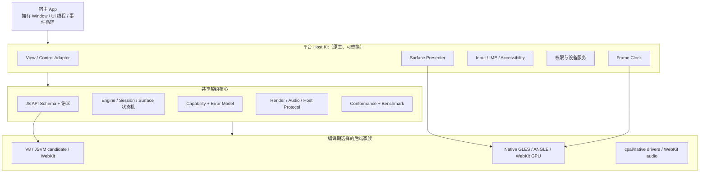

# Migo 多平台架构设计

> 状态：架构提案；Android Artifact Manifest v1 经 Claude 二轮独立复审，结论 `Ready to merge: Yes`（2026-07-16）<br>
> 当前正式支持：Android API 26+  
> 规划目标：OpenHarmony/HarmonyOS、Linux、Windows、macOS、iOS  
> 核心原则：平台最佳方案优先；只统一不会损害性能、能力与原生集成体验的部分。

## 0. 结论

Migo 不采用“一个 JS 引擎、一个窗口库、一个 GPU API 强行跑遍所有平台”的方案，也不为表面上的统一牺牲单个平台的最佳路径。

本文的决策顺序是：**硬约束先界定可行集合，性能再决定集合内的默认方案。** 正确性、安全、平台分发规则、宿主所有权和 Android API 26 等约束不可突破；满足这些约束后，端到端性能优先于统一性、代码复用率、实现方便或依赖数量。

目标架构是：

- **共享契约核心**：统一小游戏/HTML5 API 语义、生命周期、能力模型、错误模型、资源协议、测试和基准。
- **平台原生宿主**：顶层窗口、消息循环、View 生命周期、权限和系统服务由宿主 App 与平台 Host Kit 管理。
- **多后端家族**：JS、图形、帧调度和音频输出按平台编译选择；每 primitive/draw/texture 等高频数据路径不经过通用动态分发。
- **SDK 不拥有顶层窗口**：SDK 提供可嵌入 View/Control 和底层 Surface API；独立窗口只存在于可选 Player。
- **一个实现 monorepo**：契约、核心、平台适配和 conformance 同仓演进，允许一次 PR 原子更新契约与全部后端；黑盒 benchmark harness 可以保留为独立公开 consumer repo。

这不是“最低公分母”架构。Windows 以 ANGLE→D3D11、macOS 以 ANGLE→Metal 作为首个原生基线，是因为它们适合 WebGL/GLES 语义；Android、Linux 和 OpenHarmony/HarmonyOS 可以继续以原生 EGL/GLES 起步；iOS 则允许 WebKit 拥有自己的 JS 与渲染管线。它们只有通过各自端到端性能门后才成为 supported 默认，不是靠本文措辞永久锁定。

## 1. 范围、术语与硬约束

### 1.1 范围

本文定义：

- 各目标平台的 JS、graphics、window/surface、frame pacing、audio 方案；
- 第三方 App 如何嵌入 Migo；
- 当前仓库需要怎样拆分、适配和升级；
- 平台能力、兼容性和性能如何验收；
- 开放开发项目在构建、依赖、治理和发布方面的架构要求。

本文不定义账号、商店、CDN、支付结算、内容运营等平台业务。

### 1.2 术语

- **Engine**：进程级运行时，拥有共享配置、缓存、工作线程和能力注册。
- **Session**：一个小游戏实例，拥有独立 JS realm、生命周期、资源和错误域。
- **SurfaceAttachment**：Session 与一个宿主绘制目标的临时绑定；由 generation 标识。
- **Host Kit**：平台原生的嵌入层，例如 Android View、Windows Control、macOS NSView。
- **Player**：Migo 自己创建顶层窗口的开发工具，不是嵌入式 SDK 的组成部分。
- **Backend family**：一组端到端兼容的 JS/graphics/presenter 实现，不代表所有平台使用同一底层 API。

### 1.3 硬约束

1. Android 最低版本固定为 **API 26**；Gradle `minSdk` 与 NDK target 必须保持为 26。
2. Android API 27+ 的能力必须经过版本、扩展或动态符号检测，API 26 设备不得因未保护的调用而失败。
3. 宿主 App 始终拥有顶层窗口、UI 线程和事件循环；Migo 不劫持它们。
4. 不允许为了跨平台抽象增加稳定存在的 CPU readback、额外纹理复制或多一层合成。
5. 每个平台先建立原生基线，再用相同硬件、内容、构建和热状态比较候选方案；没有数据时不宣称更快。
6. 新平台通过 conformance 和性能门禁之前，只能标为 experimental，不得写入“正式支持”列表。
7. JS 可观察语义、内存/线程安全、隐私、平台审核/签名规则和稳定 ABI 不得用性能理由绕过；不满足者不进入候选集合。

### 1.4 决策优先级：约束内性能第一

对 JS runtime、GPU backend、window/surface、frame pacing、audio、I/O、打包和抽象边界的任何选择，统一使用以下顺序：

1. **先过硬约束**：correctness/conformance、安全与隐私、平台政策、API 26、宿主生命周期/线程、ABI 和“无隐式 CPU copy/readback”。
2. **再比端到端性能**：真实游戏的 cold/warm start、frame time p95/p99、input-to-present、CPU/GPU time、RSS/peak memory、功耗、温升与降频、包体和更新成本。
3. **按平台和 workload profile 选择**：没有一个候选在全部指标占优时，公开权重、原始数据和取舍；可以让不同设备族使用不同已验证默认值。
4. **统一性只作次级因素**：性能相当且约束都满足时，再比较复用、维护、构建和社区贡献成本；若平台专用实现有可重复的实质收益，就保留平台专用实现。
5. **微基准不能单独定案**：JS 引擎分数、单个 draw call 或理论 API 新旧都不能替代包含 JS→render→present/audio/I/O 的完整链路。

这里的“性能优先”包含持续性能与资源效率，不等于只追求瞬时平均 FPS。会造成热降频、内存压力、启动恶化或包体不可接受的方案，必须把这些代价放在同一份平台决策记录中。

### 1.5 版本合同：运行下限、兼容基线与性能层分离

每个 support profile 必须同时定义三个不同概念，不能用一个“最低版本”替代全部含义：

- **runtime/ABI floor**：工件可以被加载并正确运行的最低 OS、API、libc/CRT、架构与 CPU 指令集；这是发布合同，写入工件 manifest。
- **minimum compatibility baseline**：CI、模拟器/虚拟机或真机必须持续覆盖的最低受支持环境；它验证加载、ABI、生命周期和功能正确性，不承担性能选型。
- **optimized tier**：较新系统、驱动或硬件上可一次性选择的原生快路径；它在初始化或 attach 冷路径完成 capability/availability 检测，不能把版本判断散落到每个 draw、command decode、texture lookup 等热路径。

所有平台使用最新稳定 SDK/工具链编译，同时显式设置较低的 deployment/runtime floor。高版本 API 必须使用 availability、扩展、动态符号或 capability guard；若启用更高 CPU 指令集的静态编译，则必须发布不同 artifact identity，禁止用 `target-cpu=native` 生成无法说明基线的通用发布物。

首批平衡基线如下。这里列的是各平台独立得出的要求，不是为了统一数字而人为抬高或降低门槛：

| support profile | runtime/ABI floor | minimum compatibility baseline | optimized tier / 说明 |
|---|---|---|---|
| Android V8 | API 26；`minSdk` 与 NDK platform 26 | API 26 emulator，并在可获得设备上补充 API 26 真机 | 高版本 frame-rate、AHardwareBuffer/driver 能力逐项检测 |
| Windows V8/ANGLE | Windows 10 1809，build 17763；MSVC ABI | 1809 VM/设备完成 DLL load、Win32 Presenter、V8/snapshot 与音频测试 | Windows 11 能力可独立启用，不抬高基础 D3D11/ANGLE 门槛 |
| macOS V8/ANGLE | macOS 13.0；`x86_64`、`arm64` 分工件 | macOS 13，两个架构在进入 supported 前都完成 artifact 与运行测试 | macOS 14+ 优先使用 `NSView.displayLink`；13 使用验证过的 fallback |
| iOS/iPadOS WebKit | iOS/iPadOS 15.0；`arm64` device | iOS 15 真机为必需基线，simulator 在对应 runtime 可用时补充 Host Kit/bridge 测试 | 最新 WebKit/系统能力按 capability 使用，不自带 V8 |
| OpenHarmony bundled V8 | API 10；实际 OHOS SDK target/ABI 单独固定 | API 10 设备验证 NativeWindow、NativeVSync、OHAudio 与 V8 工件 | API 14+ DVSync 是增强能力，不改变基础门槛 |
| OpenHarmony system JSVM | API 12 | API 12 设备验证 JSVM 语义、线程与 native bridge | API 14+ DVSync；JSVM 版本继续写入 manifest |
| Linux GNU V8 | 首发 `x86_64`，承诺后再加独立 `aarch64`；glibc 2.31；EGL/GLES 3.0 能力合同 | Debian 11 级 sysroot/用户态与 kernel 5.10 测试基线 | kernel 不是动态库 loader ABI；更新内核、Mesa/厂商驱动用于性能门 |

Linux 不用 Ubuntu/Fedora 等发行版营销版本作为 ABI。官方 `linux-gnu` 工件以 glibc、CPU baseline、动态依赖和 EGL/GLES capability 定义合同；musl、RISC-V 或更高 CPU baseline 都是独立 profile。商业 HarmonyOS 也必须使用自己的 SDK/API/签名 profile，不能继承 OpenHarmony 的 API 数字。

任何 runtime/ABI floor 的提高都属于 support contract 变更：必须先进入 deprecated 状态、给出迁移窗口，并在新的 artifact manifest schema/profile 中显式发布，不能由一次依赖升级静默改变。

## 2. 现状审计

### 2.1 可直接保留的基础

当前 Android 已具备正确的 SDK 形态：

- `MigoRuntime` 是进程级入口；
- `GameSession` 是单游戏实例；
- `MigoGameView` 已经是推荐的可嵌入组件，内部使用 `SurfaceView`；
- `MigoGameActivity` 是便利型全屏宿主；
- Surface 生命周期已使用 generation-tagged、queue-independent 的内部状态机；
- core、graphics、audio、I/O 和 platform 已分 crate；
- V8 snapshot 已有身份与新鲜度校验基础。

因此，多平台改造不应重新发明“嵌入式 View”或推翻 Android 公共 API。重点是把 Android 专用实现从共享边界中移出，同时保持 Android 行为和性能不回退。

### 2.2 已隔离与仍待实现的平台部分

| 位置 | 当前事实 | 需要改造 |
|---|---|---|
| `engine/crates/shared/surface` | generation gate/lease 负责资源存活；共享 trait 只暴露 size 与 attach 冷路径的类型视图，已不暴露 RWH/平台句柄 | 正式 C ABI runtime 落地后，由强类型 `SurfaceDescriptor` adapter 构造具体平台 Surface；不把 Rust trait object 暴露到 ABI |
| graphics↔platform boundary | 已有匹配校验的 `GraphicsPlatform`、`EglProvider`、`EglSurfaceFactory` 与 immutable prepared target；graphics 不再匹配 `AndroidNdk` 或保存裸 window integer | 为 Linux X11/Wayland、Windows/macOS ANGLE、OpenHarmony 分别实现 provider/factory，不在 common graphics 添加平台分支 |
| graphics render/upload thread | EGL provider 由 Android bootstrap 显式注入；render/upload 校验同一 backend identity，graphics 内无 `libEGL.so` | ANGLE 必须使用随包、绝对定位且具 artifact identity 的 provider；不允许静默回落到 system EGL |
| graphics EGL manager | EGL config/context/share-group、fast resize、recovery 与 teardown 已面向 prepared target；当前可运行的 window Presenter 仍只有 Android `ANativeWindow` | 增加各平台 Presenter，并通过各自正确性与性能门；不要求它们采用同一种 native descriptor |
| AHardwareBuffer 路径 | Android 零拷贝能力进入通用 graphics 代码 | 收敛为 Android capability，不假装成统一资源类型 |
| `engine/crates/platform/desktop` | 主要是软件 frame ticker 和空设备服务 | 按 Linux、Windows、macOS 分开实现 |
| `PlatformServices` | **Platform/V8 Phase A 已完成，§9.2 step 6 拆分也已完成**：不再返回 `deno_core::Extension`，`platform` crate 已移除对 `js-runtime`/`deno_core`/`deno_error` 的直接依赖；`PlatformServices` 已拆成 `DeviceServiceProvider`/`FrameClock`/`HostNotifier` 三个能力接口（marker 超 trait + 全覆盖 blanket impl，`core` 消费侧 `Arc<dyn PlatformServices>` 与调用点不变），由 `scripts/test-platform-services-capability-contract.sh` 门禁固化 | 新增能力按接口逐个加，不回到巨型 trait；runtime backend 的完整抽象（`JsBackend` trait 与 contract 提取）属于 §9.2 step 5 之后的工作 |
| `engine/crates/js-runtime` | 纯 JS shim、deno_core op 和 V8 snapshot 构建混在一起 | 明确为 V8 backend，并抽取引擎无关契约 |
| `engine/crates/core` | **Platform/V8 Phase B 已完成**：module loader、V8 code cache 和 isolate prewarm 已移入 `js-runtime`，`HostJsRuntime::new` 与事件循环 poll 改为后端无关签名；`core` 源码不再命名 `deno_core`/`deno_error`/`v8::`，`core/Cargo.toml` 已移除对 `deno_core` 的直接依赖（仅经 `js-runtime` 传递）。由 `scripts/test-core-v8-boundary-contract.sh` 在 PR/release 门禁固化 | 尚未完成：`core` 仍以直接方法调用消费宽口径 `HostJsRuntime` 表面（无 `JsBackend` trait），且尚未从 `js-runtime` 提取 schema/纯 JS/conformance；`runtime-v8` 目录重命名仍为后续机械步骤 |
| `engine/crates/snapshot-gen` | 已把 snapshot 可执行生成器部分拆出，但身份校验、选择与部分构建逻辑仍在 `js-runtime` | 保留生成器，进一步形成按 target tuple 管理的 V8 artifact/snapshot pipeline |

### 2.3 旧方案中需要纠正的判断

- `raw-window-handle` 是 Rust 生态内的句柄互操作格式，不等于 graphics 已经支持所有平台。当前 engine 已从共享 Surface/graphics 入口移除它；未来某个具体 Presenter 可以在自身内部采用 RWH，但不得重新把它升级成跨平台 ABI 或 common graphics 的窗口模型。
- winit 适合 Player 和自动化工具，不适合作为所有宿主 App 的窗口所有者。
- “Skia GL 一套实现覆盖所有平台”不是长期承诺；它是当前最短迁移路径，必须允许平台后端演进。
- iOS 不能简单概括成“只有一种 JIT 方案”。全球默认产品应选低风险的 WKWebView；其他引擎 entitlement 属于受地区、资格和分发方式约束的独立决策。
- 多平台契约不需要拆成四个仓库。对开放协作项目而言，同仓原子变更比跨仓版本锁定更重要。

## 3. 选择的架构

### 3.1 考虑过的路线

| 路线 | 优点 | 不接受的代价 |
|---|---|---|
| V8 + GLES/ANGLE 单栈 | 初始复用最多 | 容易把临时可运行路径误当成每个平台的永久最佳方案 |
| 每个平台完全独立 | 理论自由度最高 | API 语义、修复和测试快速发散，社区维护门槛过高 |
| **共享契约 + 后端家族 + 原生 Host Kit** | 平台可独立优化，同时共享产品语义与质量门 | 需要先把当前 V8/Android 耦合边界拆清楚 |

采用第三条路线。

### 3.2 目标分层



### 3.3 统一边界

应该统一：

- JS 可见 API 的名称、输入、结果、错误、异步时序和权限语义；
- Engine、Session、SurfaceAttachment 状态机；
- 输入、生命周期、host message 和资源请求的数据模型；
- 能力发现与明确的 unsupported 行为；
- conformance、render golden、故障注入和性能度量方法；
- 版本、日志、诊断、崩溃信息和安全策略。

不应统一：

- 顶层窗口、UI 框架和消息循环；
- JS 引擎嵌入 API；
- GPU device、swapchain/EGLSurface、VSync 和资源共享句柄；
- 音频设备和系统 audio session/focus；
- 权限请求 UI、文件选择器、输入法和无障碍实现；
- 发布包格式和宿主语言的惯用 API。

## 4. SDK 与窗口：第三方 App 的集成模型

### 4.1 SDK 不带顶层窗口

嵌入式 SDK 只需要一个宿主提供的绘制目标，不应自行创建 `Activity`、`HWND`、`NSWindow`、Wayland toplevel 或 `WindowStage`。

推荐交付三层产品：

| 层 | 是否创建顶层窗口 | 用途 |
|---|---:|---|
| `migo-core` | 否 | Engine、Session、JS、graphics、audio、I/O |
| Platform Host Kit | 否 | 可嵌入 View/Control 与底层 Surface Adapter |
| `migo-player` | 是 | 示例、调试、bench、截图、CI、独立运行 |

Host Kit 可以提供一个方便的 View/Control，但 View 不等于 Window。宿主仍决定它位于哪个页面、窗口或 UI 树中。

`migo-player` 是**可选 shell**，不是运行时的一部分：它存在是为了让示例、bench、截图和 CI 有一个能自己开窗的入口，嵌入式集成永远不经过它。事件循环同样属于宿主——引擎不 spin 宿主的 loop，帧驱动通过宿主安装的 `on_request_frame` + `migo_session_notify_vsync` 回到引擎（Android SDK 走 Choreographer，纯原生宿主自己提供）。

#### 4.1.1 谁拥有窗口的生命周期

宿主拥有窗口，因此**只有宿主能销毁它**——但它必须等引擎说可以。

`migo_surface_begin_detach` 返回 `MIGO_OK` 只表示退役已经开始，不表示 driver 已经用完这个窗口：GPU 无法被同步地忘记一个 Surface。宿主必须轮询 `migo_surface_release_query` 到 `MIGO_SURFACE_RELEASE_RELEASED` 之后，才能 `XDestroyWindow` / `wl_surface_destroy` / 释放 `ANativeWindow`。提前销毁是 driver 内部的 use-after-free，**引擎既检测不到也阻止不了**，因为它要观察的引用不属于自己。

对称地，`migo_session_destroy` 在还有存活 attachment、正在进行的 transition 或未完成的 release 时会返回 `MIGO_ERROR_INVALID_STATE` 而不是替宿主收尾。这是引擎**还能**捕获的错误，所以它拒绝；拆解顺序因此永远是 begin_detach → 轮询到 RELEASED → destroy。

release observer 不持有 Surface 资源租约，所以它可以活过自己的 Session——这正是「先销毁 Session」的拆解顺序仍然安全的原因。

三个 C 宿主示例（X11、Wayland、Android NativeActivity）都实现了这个等待，且 Wayland 那份在等待时必须继续 dispatch display：释放 buffer 可能需要与合成器往返，只 sleep 会一直等到超时。

### 4.2 两级接入 API

**高级接入**面向普通 App：

- Android：`MigoGameView`；
- Windows：计划中的 Win32/WinUI Host Control；
- macOS：计划中的 `MigoView : NSView`；
- Linux：可选 Qt 6/GTK 4 adapter；
- OpenHarmony/HarmonyOS：ArkUI `XComponent` wrapper；
- iOS：包装 `WKWebView` 的 `MigoView : UIView`。

高级组件负责 surface callback、输入、IME、DPI、可见性和宿主生命周期。

**低级接入**面向编辑器、自研 UI 框架和游戏引擎：

```c
MigoResult migo_engine_create(
    const MigoEngineConfig*, MigoEngine** out_engine);
MigoResult migo_session_create(
    MigoEngine*, const MigoSessionConfig*, MigoSession** out_session);

MigoResult migo_session_attach_surface(
    MigoSession*,
    const MigoSurfaceDescriptor*,
    MigoSurfaceAttachment** out_attachment);

MigoResult migo_surface_update(
    MigoSurfaceAttachment*,
    const MigoSurfaceMetrics*);

typedef void (*MigoTaskFn)(void* task_context);
typedef MigoResult (*MigoDispatchFn)(
    void* dispatcher_context,
    MigoTaskFn task,
    void* task_context);

typedef struct MigoHostCallbacks {
    uint32_t struct_size;
    uint32_t abi_version;
    void* user_data;
    void* dispatcher_data;
    MigoDispatchFn dispatch;
    void (*on_ready)(void* user_data, MigoSession*);
    void (*on_error)(void* user_data, MigoSession*, const MigoError*);
    void (*on_exit_requested)(void* user_data, MigoSession*);
    void (*on_surface_lost)(
        void* user_data,
        MigoSession*,
        uint64_t generation,
        MigoSurfaceLossReason reason);
} MigoHostCallbacks;

MigoResult migo_session_set_host_callbacks(
    MigoSession*,
    const MigoHostCallbacks*);

MigoResult migo_session_set_visibility(MigoSession*, uint8_t visible);
MigoResult migo_session_set_focus(MigoSession*, uint8_t focused);

/* Surface 退役是异步的：GPU 无法被同步地「忘记」一个 Surface，
   driver 侧引用会活过调用返回。begin_detach 只是开始退役，
   宿主必须轮询到 RELEASED 才能销毁自己的原生窗口。 */
MigoResult migo_surface_begin_detach(
    MigoSurfaceAttachment*,
    MigoSurfaceRelease** out_release);
MigoResult migo_surface_release_query(
    const MigoSurfaceRelease*,
    MigoSurfaceReleaseStatus* out_status);
MigoResult migo_surface_release_destroy(MigoSurfaceRelease*);

MigoResult migo_session_destroy(MigoSession*);
```

[`include/migo/migo.h`](../include/migo/migo.h) 与强类型平台 descriptor 已经**有可链接实现**，不再是 compile-only：`engine/crates/capi` 导出 22 个 `migo_*` 入口点，desktop Linux 与 Android 各自有一份可链接 runtime，所以 `MIGO_C_ABI_HAS_RUNTIME` 在这两个平台上是 1。

⚠️ 这个宏问的是「该 target 是否存在可链接 runtime」，**不是「ABI 是否已冻结」**——`MIGO_C_ABI_CANDIDATE` 仍为 1，`include/migo/README.md` 列的冻结阻塞项仍有未满足项。

判定这个宏时**必须区分三个 Linux-kernel target**：Android 与 OpenHarmony 同样定义 `__linux__`，只测 `__linux__` 会一次性替三个不同 ABI 作答，并且会在没有构建产物的 OpenHarmony 上谎称有 runtime。因此 `types.h` 按 `__ANDROID__` / `__OHOS__` / `__linux__ && __GLIBC__` 精确分类，`tests/c_abi/core_contract.c` 断言三者互斥。

Android 的差距是**打包而不是能力**：静态库可链接并已在真机跑通，但没有 pkg-config、CMake package 或带版本的 .so，宿主只能从源码树链接；desktop Linux 三样齐全。正式 C ABI 必须：

- 每个结构带 `struct_size` 与 `abi_version`；
- 返回稳定错误码，不允许 panic/exception 穿过 ABI；
- 不暴露 Rust enum 布局、trait object 或 `raw-window-handle` 版本；
- 枚举型公开值使用显式定宽整数 typedef 与数值常量，不依赖 C enum 的实现相关底层宽度；明确调用线程、回调线程和 handle 所有权；
- 回调必须经过宿主提供的 dispatcher；当前 candidate 在配置任意回调时要求 dispatcher 非空，不能从任意 worker/render 线程直接进入宿主 UI；
- `set_host_callbacks` 复制调用方 `struct_size` 覆盖的已知字段，不长期借用临时结构；destroy 返回前取消或排空尚未投递的回调任务；
- callback 配置只能在首次 attach/运行前成功安装一次，避免已排队任务与替换后的函数指针或 `user_data` 竞态；
- 允许宿主在 Session 不销毁的情况下反复 attach/detach Surface；
- 平台扩展通过带版本的结构链或 capability 查询增加，不能破坏旧 ABI。

上面的 callback、visibility 和 focus 同样只是契约形状示意。ABI v1 还必须覆盖 pause/resume、输入、Surface loss、异步请求取消以及回调中重入/销毁的规则；只给 attach 函数而不定义事件如何回到宿主，不算完成嵌入式 ABI。

### 4.3 SurfaceDescriptor

共享 header 只保存真正通用的数据：

- ABI version、platform kind、surface generation；
- width/height（physical pixels）、scale factor；
- color space、alpha mode、期望 presentation mode；
- 平台描述符大小和 capability flags。

平台 payload 使用强类型描述符：

- Android：`ANativeWindow` 的受控引用；
- Win32：child `HWND`；
- WinUI：专用 composition/swapchain attachment，而不是假装成 HWND；
- macOS：`NSView`/`CAMetalLayer` adapter；
- Linux X11：Display + Window；
- Linux Wayland：`wl_display` + `wl_surface`，role 和 event loop 仍由宿主拥有；
- OpenHarmony/HarmonyOS：`OHNativeWindow`；
- iOS WKWebView backend 不经过通用 native GPU Surface。

具体 Presenter 可以在 attach 冷路径把 payload 转换成该平台最合适的 immutable prepared target；是否在 Presenter 内部借助 `raw-window-handle` 是实现细节。当前 Android Presenter 直接以非 owning `NonNull<ANativeWindow>` prepared target 对接 system EGL，shared/core/graphics 不读取该指针。prepared target 的有效期由 generation-tagged `SurfaceLease` 保证，任何 EGL 引用都必须先销毁，之后才能释放 lease。

### 4.4 生命周期与线程

```text
Engine create
  └─ Session create
       ├─ Surface attach (generation N)
       ├─ start / pause / resume
       ├─ resize / DPI / color-space update
       ├─ Surface detach (generation N)
       ├─ Surface attach (generation N+1)
       └─ Session destroy
```

不变量：

- Session 生命周期与 Surface 生命周期分离；
- 过期 generation 的 resize、present 和 callback 必须被拒绝；
- `SurfaceAttachment` 是唯一 handle；detach 成功会消费并释放它，之后指针无效，且不得再向旧 Surface present；Session destroy 会消费仍存活的 attachment；
- 平台需要 UI 线程的 attach 操作由 Host Kit 调度，render loop 不在 UI 线程运行；
- 同步 detach 不得等待宿主 dispatcher 的下一次调度；线程亲和性不满足时，必须在改变 generation/ownership 前返回 `MIGO_ERROR_WRONG_THREAD`；
- 回调通过宿主配置的 dispatcher/executor 投递，不能假设所有宿主都使用同一种消息循环；
- SDK 不主动退出宿主进程，不接管全局键盘、焦点或窗口状态。

### 4.5 桌面接入矩阵

| 宿主 | 第一阶段接入 | 性能要求 |
|---|---|---|
| Win32/C++ | 宿主创建 child HWND，传给 Win32 Presenter | ANGLE/DXGI 直接 present，不经过 CPU bitmap |
| WinForms/WPF | 通过 child HWND/HwndHost | 不以 `D3DImage` readback 作为通用路径 |
| WinUI 3 | 专用 `SwapChainPanel`/composition adapter | 单独做 ANGLE/DXGI interop spike；必须零拷贝 |
| AppKit | 嵌入 Migo NSView | ANGLE Metal 直接绑定 layer |
| SwiftUI on macOS | `NSViewRepresentable` 包装 Migo NSView | 不增加离屏复制 |
| Qt 6 | 可选 adapter 获取实际 X11/Wayland target | 不让 winit 再创建第二个 event loop |
| GTK 4 | 在 realize/unrealize 中 attach/detach | 遵守 GDK backend 与 UI 线程规则 |
| 自研引擎/编辑器 | C ABI + platform descriptor | 可增加平台专用 ExternalTextureTarget |

[WinUI 3 `SwapChainPanel`](https://learn.microsoft.com/en-us/windows/windows-app-sdk/api/winrt/microsoft.ui.xaml.controls.swapchainpanel) 可以进入 XAML visual tree，并有自己的 UI/threading 约束，因此不能只提供一个“万能 window pointer”。

### 4.6 外部纹理模式

部分编辑器或已有 GPU compositor 不希望 Migo 自己 present，而希望把画面作为纹理合成。可在 onscreen 模式稳定后增加 `ExternalTextureTarget`：

- D3D11 shared texture / keyed mutex 或明确的 fence；
- IOSurface/Metal texture；
- DMA-BUF + sync fd；
- AHardwareBuffer；
- OHNativeBuffer。

这是五套平台能力，不设计一个伪通用的 CPU RGBA buffer。只有在资源共享、同步和生命周期均可证明零拷贝时才启用。

## 5. 图形架构

### 5.1 当前基线

当前 graphics 使用 Skia Ganesh GL、`glow`、EGL/GLES；Canvas2D 与 WebGL 可以共享 GPU context/resource 路径。EGL 实现选择和 window-surface 创建已通过冷路径 `GraphicsPlatform` 注入，Android 使用 system EGL + `ANativeWindow` Presenter；draw/present/swap 热路径没有新增 Presenter downcast、分配、锁或虚调用。这是 Android 的已实现基线，也是 Linux/OpenHarmony 初期的合理起点。

### 5.2 后端家族

| family | 目标平台 | 组成 |
|---|---|---|
| `gles-native` | Android、Linux、OpenHarmony/HarmonyOS | 系统 EGL/GLES + 平台 Presenter |
| `angle` | Windows、macOS | ANGLE EGL/GLES → D3D11/Metal |
| `webkit` | iOS | WebKit 拥有 Canvas/WebGL/GPU 合成 |
| `vulkan-experimental` | Android、Linux 候选 | 仅在完整 WebGL+Canvas2D 路径胜出后升级 |
| `native-modern-experimental` | Windows/macOS 候选 | Graphite/Dawn/direct native，只作为长期实验 |

ANGLE 的目标就是把 WebGL/OpenGL ES 映射到平台 GPU API。Windows D3D11 是成熟度最高的主力后端；macOS Metal 是受支持并已实际部署的后端，但仍须用 Migo 的 Intel/Apple Silicon 与窗口组合矩阵做独立 spike，不能假定它与 D3D11 具有相同成熟度。因此这里使用 ANGLE 是有证据的起点，不是永久免评估的统一层。[ANGLE 官方仓库](https://github.com/google/angle)

Skia Vulkan 可以与 GL 同时构建，但官方仍提示真实设备驱动问题；Migo 不做大爆炸式迁移。[Skia Vulkan 文档](https://docs.skia.org/docs/user/special/vulkan/)

### 5.3 后端选择规则

1. 后端按 target/profile 编译决定；每 primitive、draw、texture lookup、command decode 等高频数据路径不得做通用 trait-object 分发。
2. SurfaceFactory、Presenter、FrameClock 和 capability discovery 属于控制路径，可以使用小接口或枚举；每帧一次的 VSync request/present control 允许动态派发，但必须独立计量调用和唤醒开销。
3. command decode、draw batching、texture lookup 和 submit 数据路径必须静态特化或一次选择后固定。
4. Canvas2D、WebGL、图片解码上传和 onscreen present 必须尽量处于同一个 GPU device family。
5. 如果混用两个 API 会导致跨 device copy，即使单项 benchmark 更快也不得成为默认。
6. software renderer 只用于 CI/fallback，不冒充正式 GPU 后端性能。
7. **runtime 热路径不得引入服务端框架**（`actix`、`tokio` 多线程 runtime、Web 框架、通用 actor/消息总线等）。它们为吞吐和公平调度而设计，代价是每条消息的分配、跨线程唤醒和调度延迟——正是渲染与输入路径最不能付的开销。输入、命令流、draw/present 必须是直接调用或预先特化的路径；需要并发的地方用已有的有界命令队列与 generation gate。构建期工具（如 `tools/artifact-manifest`）不受此限，因为它们不链接进 `libmigo.so`。

### 5.4 资源互操作

通用层描述“资源能做什么”，不描述“资源是什么”：

- `CpuPixels`：明确 stride、format、color space 和所有权；
- `GpuImage`：后端内部 opaque handle；
- `ExternalImage`：平台能力 + import contract；
- `SyncPrimitive`：后端内部 fence/semaphore；
- `Readback`：显式慢路径，带诊断计数。

AHardwareBuffer、DMA-BUF、IOSurface、D3D shared resource 和 OHNativeBuffer 分别留在平台模块。上层只能通过 capability 请求零拷贝，不能假定每个平台都支持相同组合。

### 5.5 帧调度

- 逻辑更新、render submit 和 present timing 分开测量；
- FrameClock 提供 timestamp、refresh period、deadline 和 generation；
- render 线程按需请求下一帧，静止内容不持续唤醒；
- host callback 晚到、Surface 被替换和 refresh rate 改变都必须有状态机测试。

Android 当前使用 demand-driven Choreographer。Android 官方指出单独使用 Choreographer 仍可能发生 buffer stuffing；应将 [Android Frame Pacing/Swappy](https://developer.android.com/games/sdk/frame-pacing) 作为 API 26 设备上的决策实验，而不是未经测量直接替换。

Windows ANGLE/DXGI Presenter 应评估 frame-latency waitable object，以在上一帧完成 presentation 后安排下一帧。[DXGI frame latency waitable object](https://learn.microsoft.com/en-us/windows/win32/api/dxgi1_3/nf-dxgi1_3-idxgiswapchain2-getframelatencywaitableobject)

## 6. JavaScript Runtime 与 API 契约

### 6.1 契约是产品本体

当前 `js-runtime` 同时包含：

- 后端无关的 JS shim；
- deno_core/V8 op 注册与 Rust 实现；
- snapshot 构建和指纹；
- 渲染、设备、网络等模块入口。

Platform/V8 Phase A 移除了 `PlatformServices::extensions()` 和 `platform` 的直接 runtime 依赖，Phase B 又把 module loader、code cache、isolate prewarm 和事件循环 poll 的所有权移入 `js-runtime`，`engine/crates/core` 源码已不再直接使用 deno_core/V8 类型。但 `core` 仍以直接方法调用消费 `HostJsRuntime` 的宽口径表面，尚未成为完全引擎无关层。`engine/crates/snapshot-gen` 已经拆出了可执行生成器，但 snapshot 身份和选择仍有一部分留在 `js-runtime`。

目标是抽取语言中立的 schema 和测试，但不强制所有 JS 引擎使用同一种 bridge。这里的“core”是目标边界，不是把当前同名 crate 原样宣布为通用层：平台服务不暴露 `deno_core::Extension`、core 源码不再命名 deno_core 的门已经成立；仍须把宽口径 `HostJsRuntime` 表面收敛到 `JsBackend` trait，并从 `js-runtime` 提取 schema/纯 JS/conformance，完整不变量才成立。

```text
contracts/
  api-schema/       # 参数、结果、错误、能力、同步/异步语义
  js/               # 后端无关的纯 JS 层
  types/            # TypeScript declarations
  conformance/      # fixtures、assertions、goldens

runtime-v8/
  engine/           # 从当前 core 移入的 host/isolate/loader/code-cache
  ops/              # deno_core/V8 adapter；平台 V8 extension 在这里注册
  snapshot/

runtime-jsvm/       # 决策实验通过后才落地
runtime-webkit/     # iOS bridge 与 JS bootstrap
```

### 6.2 同步与异步语义

契约必须逐 API 标记：

- pure JS synchronous；
- engine-local synchronous；
- async host request；
- cached synchronous view；
- platform unsupported。

iOS 的 `WKScriptMessageHandlerWithReply` 是异步 bridge。[Apple WebKit 文档](https://developer.apple.com/documentation/webkit/wkscriptmessagehandlerwithreply)  
不能为了假装同步而阻塞 WebKit/UI 线程。需要同步读取的状态应在 JS 侧缓存，或在契约中改为异步；不同后端必须保持 JS 可观察语义一致。

### 6.3 Capability 模型

每项能力属于以下一种：

- `required`：该 support profile 的强制能力；
- `optional`：可查询、不可假定；
- `host-provided`：由宿主注册实现；
- `permission-gated`：需要平台权限；
- `unsupported`：返回稳定错误，不提供空成功或静默 no-op。

Capability 包含版本和限制，例如最大 texture size、audio channel、外部纹理格式、传感器精度和 API 速率限制。平台差异应被显式表达，而不是用假实现抹平。

### 6.4 V8 静态库与 snapshot 工件矩阵

**只要某个平台选择 native V8，就必须为该目标单独构建或取得匹配的 `librusty_v8`；不能按 CPU 名称复用其他 OS 的库。** Android arm64、Linux arm64 和 OpenHarmony arm64 虽然 CPU 都是 AArch64，但它们的 target OS、sysroot、libc、链接 ABI 与工具链不同，是三套工件。反过来，使用 system JSVM 的 OpenHarmony/HarmonyOS 与使用 WKWebView 的 iOS 不携带 V8。

官方 V8 构建用 GN 的 `target_os`、`target_cpu`/`v8_target_cpu` 选择目标，Android 也有独立交叉编译流程；Rust 绑定 `rusty_v8` 的预编译产物同样是按目标配置发布的静态库。[V8 GN 构建](https://v8.dev/docs/build-gn)、[V8 ARM/Android 交叉编译](https://v8.dev/docs/cross-compile-arm)、[rusty_v8 构建说明](https://github.com/denoland/rusty_v8#binary-build)

#### 6.4.1 工件身份

不能只用 `aarch64/librusty_v8.a` 作为长期身份。一个可链接、可复现的 V8 工件至少由以下 tuple 唯一确定：

```text
V8ArtifactId = {
  rusty_v8 version + V8 revision,
  target triple / target_os / target_cpu,
  architecture + static CPU baseline + required instruction features,
  minimum OS/API or libc/CRT runtime floor,
  ABI + compiler + sysroot version,
  libc / C++ runtime / Windows CRT,
  normalized GN args and patches,
  release/debug + security/runtime flags
}
```

只要其中一项影响 ABI、external references 或运行时布局，就必须生成新工件和新 identity；不同 product profile 若只改变 Migo API feature 而不改变 GN 配置，可以共享 V8 archive，但不能共享错误 profile 的 startup snapshot。

建议目标布局：

```text
engine/third_party/rusty_v8/
  <rusty-v8-version>/
    <target-triple>/
      <config-id>/
        <target-static-v8-archive>
        src_binding.rs
        artifact-manifest.json
```

`artifact-manifest.json` 记录完整 tuple、architecture/CPU baseline、最低 OS/API 或 glibc/CRT、编译器/NDK/Xcode/Visual Studio 版本、V8 revision、GN args、patch、archive/binding hash、许可证和来源。大二进制可放 Git LFS 或签名的 release artifact，但公开仓库必须拥有从 pinned source 重建它的 recipe；核心构建不能只依赖维护者私有 binary cache。

#### 6.4.2 首批目标矩阵

| runtime backend / 平台 | 首批 V8 目标 | 规则 |
|---|---|---|
| Android V8 | `aarch64-linux-android`、`x86_64-linux-android` | 两套必需；NDK target/API 固定 26，archive、binding 与 snapshot 均按 ABI 校验 |
| Linux V8 | `x86_64-unknown-linux-gnu`；需要 ARM 主机时增加 `aarch64-unknown-linux-gnu` | 不能复用 Android archive；glibc 是首个 support profile，musl 若承诺支持则是独立 target/工件 |
| Windows V8 | `x86_64-pc-windows-msvc` 首发；ARM64 作为后续独立 profile | 使用 MSVC ABI 并固定 CRT/链接参数；MinGW 不是同一工件，也不作为隐含 fallback |
| macOS V8 | `aarch64-apple-darwin`、`x86_64-apple-darwin` | 两个架构分别构建和测试；分发层可做 universal/XCFramework slices，但运行时 identity 和 snapshot 仍按实际进程架构区分 |
| OpenHarmony/HarmonyOS system JSVM | 无 | 默认候选若验证通过，不构建、不分发 V8 |
| OpenHarmony/HarmonyOS bundled V8 | 对选定 OHOS target/arch 单独构建 | 必须使用对应 SDK 的 Clang/sysroot/ABI；绝不能复用 Android arm64 archive |
| iOS WKWebView | 无 | 全球默认 backend 不链接 V8；不因 V8 官方可交叉编译 iOS 就增加审核、JIT/JITless 和包体复杂度 |

这不是要求“先把所有可能平台全部编完”。只有进入 native-V8 support profile 的 target 才进入构建矩阵，并且先从实际承诺的架构开始。V8 官方也明确以其 CI bot 覆盖来界定受支持配置，因此每个 Migo target 都要核对 upstream support，并维护自己的构建与运行测试，不能从“V8 支持很多配置”推导出“任意 tuple 都稳定”。[V8 官方支持配置](https://v8.dev/docs/official-support)

#### 6.4.3 当前 repo 差距

当前仓库已有：

- `engine/third_party/rusty_v8/aarch64` 与 `x86_64` 两套 Android archive/binding；
- `scripts/build-v8-android.sh`，支持 Android API 26 的 aarch64/x86_64 构建；
- `snapshot-gen`、schema-v3 manifest 与 archive/JS/runtime 指纹校验。

但现有目录只以 CPU 命名，跨平台后会产生歧义；`js-runtime/build.rs` 也只对 Android 选择 snapshot。当前工作树实际存在的 host/worker snapshot 文件只有 aarch64，尽管 snapshot README 描述了 x86_64 目标。因此在宣称 Android 双 ABI release 完整前，必须补齐或明确禁用缺失 ABI 的 snapshot candidate；桌面支持前则要把 archive 和 snapshot selector 升级为 target-triple identity。

#### 6.4.4 Snapshot 不是通用资源

V8 archive 与 startup snapshot 是两类工件。每个 snapshot 还必须绑定：

```text
SnapshotId = {
  V8ArtifactId,
  target OS + target arch,
  CPU baseline and snapshot-generation CPU policy,
  Migo product feature/profile,
  runtime kind (host or worker),
  deno_core + extension/op order + external references,
  bootstrap JS/Rust input hashes,
  snapshot schema + bytes hash
}
```

规则如下：

- Android snapshot 不能给 Linux 使用，arm64 snapshot 不能给 x86_64 使用；
- macOS 即使分发 universal library，也分别嵌入当前 Rust target 对应的 snapshot，不能制造“universal snapshot”；
- V8 revision、GN args、extension/op 表、runtime kind 或 product profile 变化都重新生成；
- 生成器必须使用目标兼容的 V8 工件；无法证明 identity 时回退 source bootstrap，显式性能 candidate 则 fail closed；
- snapshot 只有在真实设备证明冷启动收益大于包体/内存代价后才成为该 profile 默认。

#### 6.4.5 SDK 分发方式

桌面 App 的接入者不应手工寻找和链接 V8。每个平台的 Migo runtime package 默认将对应目标的 `rusty_v8` 静态链接进 `libmigo.so`、`migo.dll` 或 framework/dylib，并隐藏 V8 C++ symbols；Host Kit 再以正常的 C/C++、NuGet、SwiftPM 或 toolkit adapter 交付。一个下载仓库可以发布多平台 artifacts，但单个平台安装包只携带它需要的 architecture slices，不能把 Android、Linux、Windows、macOS 的 V8 库一起塞入最终 App。

每次 V8 升级需在全部 supported native-V8 targets 上完成：从公开 recipe 重建、archive/manifest 校验、最小 isolate 启动、Migo conformance、snapshot restore、ASan/平台安全检查以及包体/启动回归。任一 supported target 未完成时，该次升级不能只在 Android 验证后整体发布。

### 6.5 全平台发布工件 manifest

每个可分发平台工件都必须携带机器可读的 per-slice manifest；这项要求不只适用于 V8 archive。Android AAR、Windows DLL/NuGet、macOS/iOS XCFramework/SwiftPM bundle、Linux tar/package、OpenHarmony HAR/HSP 共享身份字段与验证语义，但按平台 profile 校验各自的 floor/backend。当前 repo 的可执行 `v1` validator 先实现 Android profile；桌面或 system-runtime profile 进入 supported 前必须增加对应 schema 条件与测试，不能绕过 Android validator 或把不适用字段伪造为 Android。

当前 Android slice 的 wire shape 如下；尖括号表示构建流程写入的实际、不可省略值，不是允许留在 release 中的占位符：

```jsonc
{
  "schema": "migo-artifact-manifest/v1",
  "artifact_id": "<content-addressed-id>",
  "product_profile": "full",
  "build_type": "release",
  "codegen_profile": "z",
  "target": {
    "triple": "aarch64-linux-android",
    "os": "android",
    "arch": "aarch64",
    "abi": "android",
    "cpu_baseline": "armv8-a",
    "required_cpu_features": ["neon"],
    "runtime_floor": { "android_api": "26" }
  },
  "toolchain": {
    "rustc": "<exact-version>",
    "compiler": "<exact-clang-or-msvc-version>",
    "sdk": "<exact-sdk-and-sysroot-version>",
    "linker": "<exact-version>"
  },
  "runtime": {
    "backend": "v8",
    "rusty_v8_version": "<exact-version>",
    "rusty_v8_revision": "<full-rusty-v8-revision>",
    "v8_revision": "<full-upstream-revision>",
    "normalized_gn_args": ["is_debug=false", "<remaining-sorted-args>"],
    "patches": [
      { "id": "<ordered-patch-id>", "sha256": "<sha256>" }
    ]
  },
  "snapshots": [
    {
      "runtime_kind": "host",
      "product_profile": "full",
      "target_triple": "aarch64-linux-android",
      "arch": "aarch64",
      "schema": "<snapshot-schema-version>",
      "generator": "<snapshot-generator-version-and-hash>",
      "generation_cpu_policy": "target-baseline",
      "normalized_parameters": [
        "--arch=aarch64",
        "--cpu-policy=target-baseline",
        "--product-profile=full",
        "--runtime-kind=host",
        "--warmup=none"
      ],
      "external_references_hash": "<sha256>",
      "bootstrap_inputs_hash": "<sha256>",
      "bytes_hash": "<sha256>"
    }
  ],
  "graphics": {
    "backend_family": "gles-native",
    "required_api": "OpenGL ES 3.0"
  },
  "hashes": {
    "runtime_binary": "<sha256>",
    "v8_archive": "<sha256>",
    "rust_binding": "<sha256>",
    "cxx_runtime": "<sha256>"
  },
  "provenance": {
    "source_revision": "<migo-full-revision>",
    "build_recipe": "<repository-relative-path>",
    "build_recipe_sha256": "<sha256>",
    "licenses": ["<sorted-SPDX-expression>"]
  }
}
```

最终容器包的 SHA-256 **不能嵌入该包自身**，否则会形成不可解的自引用。发布身份因此固定为三层：

1. 每个 architecture slice 内嵌一份 manifest；`artifact_id` 是删除自身 `artifact_id` 后，对规范化 JSON 求 SHA-256。对象键按字节序排序，数组保持已验证顺序，浮点数禁止进入 identity。
2. 容器内嵌一份 `migo-artifact-package-index/v1`，记录每个 slice 的包内相对路径、manifest 文件 SHA-256 与 `artifact_id`。
3. 完成 AAR/NuGet/XCFramework/tar/HAR 后，在包外生成 `migo-release-attestation/v1` sidecar，记录最终文件名、大小、package SHA-256 与内嵌 index SHA-256。签名/SBOM 包装 sidecar 与 package，而不是修改已经哈希的包。

这里必须区分**完整性**与**来源真实性**：未签名的 v1 content hash 能证明字段与所校验字节一致、稳定地产生同一 identity，却不能证明这些字节来自 Migo 官方构建者；攻击者可以同时替换 package、manifest 和 hash。开源、pinned revision 与公开 recipe 支持独立复现，但也不等于发布者认证。正式公开 release 必须由受保护的 builder 对 package 与 sidecar 签名（或写入可验证 transparency log），并发布验证公钥/策略；在该链路落地前只能称为 `verified identity`，不能称为 trusted/signed artifact。attestation 的 `package_index_sha256` 已传递绑定 index 中的 product/build/codegen 和所有 slices，无需在 sidecar 重复这些字段。

```jsonc
// embedded package-index.json
{
  "schema": "migo-artifact-package-index/v1",
  "product_profile": "full",
  "build_type": "release",
  "codegen_profile": "z",
  "slices": [{
    "target_triple": "aarch64-linux-android",
    "arch": "aarch64",
    "manifest_path": "assets/migo/artifacts/slices/arm64-v8a.json",
    "manifest_sha256": "<sha256>",
    "artifact_id": "<sha256>"
  }]
}

// external migo-full-release.aar.attestation.json
{
  "schema": "migo-release-attestation/v1",
  "package_file": "migo-full-release.aar",
  "package_size_bytes": 123,
  "package_sha256": "<final-aar-sha256>",
  "package_index_file": "package-index.json",
  "package_index_sha256": "<embedded-index-sha256>"
}
```

首批 profile 写入 manifest 的固定合同如下。表中的“精确 V8 revision”表示构建时写入完整 upstream commit/revision，不能只写 `rusty_v8` crate 版本或分支名；“per-slice”表示同一个容器包中的每个 ABI/architecture 都有独立 manifest 和 identity。

| artifact/profile | `arch` 与静态 CPU baseline | `runtime_floor` | runtime、V8 revision 与 snapshot |
|---|---|---|---|
| Android AAR / `arm64-v8a` | `aarch64`；ARMv8-A + AdvSIMD，不静态要求可选 ARMv8.x 扩展 | `android_api: 26` | bundled V8；精确 V8 revision/GN args；host/worker snapshot 按 ABI、profile 和 target-baseline 参数生成 |
| Android AAR / `x86_64` | `x86_64`；`x86-64-v1`，至少 `cmov`/`sse2` | `android_api: 26` | bundled V8；与 arm64 分开的 archive、binding、revision tuple 和 snapshot |
| Linux GNU / `x86_64` | `x86_64`；`x86-64-v1`，至少 `cmov`/`sse2` | `glibc: 2.31`、`glibcxx: 3.4.28` | bundled V8；精确 V8 revision/GN args；**当前 `snapshot_policy: "none"`、`snapshots: []`**（Linux 尚未生成 startup snapshot）；kernel 5.10 只进入 `minimum_test_baseline` |
| Linux GNU / `aarch64` | `aarch64`；ARMv8-A + AdvSIMD | `glibc: 2.31` | 仅在承诺该 profile 时发布独立 V8 archive/binding/snapshot，不能复用 Android arm64 |
| Windows MSVC / `x86_64` | `x86_64`；`x86-64-v1`，至少 `cmov`/`sse2` | `windows_build: 17763` | bundled V8；精确 V8 revision/GN args；per-arch snapshot；同时记录 MSVC/UCRT 与 VC runtime 部署方式 |
| macOS / `arm64` | `aarch64`；Apple arm64 ABI（AArch64 + AdvSIMD），不静态要求可选 ARMv8.x 扩展 | `macos: 13.0` | bundled V8；精确 V8 revision/GN args；arm64 snapshot；universal 分发包仍保留 per-slice identity |
| macOS / `x86_64` | `x86_64`；`x86-64-v1`，至少 `cmov`/`sse2` | `macos: 13.0` | bundled V8；与 arm64 分开的 archive、binding 和 snapshot |
| OpenHarmony bundled-V8 / `aarch64` | `aarch64`；目标 OHOS SDK ABI，首批基线 ARMv8-A + AdvSIMD | `openharmony_api: 10` | 精确 OHOS SDK/Clang/sysroot、V8 revision/GN args；per-profile host/worker snapshot |
| OpenHarmony system-JSVM / `aarch64` | `aarch64`；目标 OHOS SDK ABI，首批基线 ARMv8-A + AdvSIMD | `openharmony_api: 12` | `v8_revision: null`、`snapshots: []`；记录 JSVM API/SDK identity、bridge schema；API 14+ DVSync 只写 optimized capability |
| iOS device / `arm64` | `aarch64`；Apple arm64 ABI（AArch64 + AdvSIMD） | `ios: 15.0` | `v8_revision: null`、`snapshots: []`；记录 WebKit/SDK identity、bridge schema；simulator slice 使用独立 target/manifest |

上表不是文档承诺而是**被校验的合同**。每个 slice manifest 都有 JSON schema 与工具校验：Android slice 走 `contracts/artifact-manifest/schema-v1.json` + `migo-artifact-manifest verify-slice`；Linux GNU slice 走 `contracts/artifact-manifest/linux-package-schema-v1.json` + `migo-artifact-manifest verify-linux-package`，并由 `scripts/test-linux-sdk-contract.sh` 对照真实产物核对 DT_NEEDED、导出符号与 loader floor。

其中三条规则是**禁止混用**，因为它们的失败方式都是「链接得上、跑起来才炸，且现场没有 provenance」：

1. **V8 必须按 OS/ABI/arch 分别构建。** manifest 记录的 `v8.target` 必须等于 slice 自身的 target；一个为 Android 构建的 V8 放进 Linux 包会被 `verify-linux-package` 直接拒绝。
2. **snapshot 必须与 V8 revision、生成参数和 CPU baseline 匹配。** snapshot 是 V8 机器码，`target_triple`/`arch` 不符不是「次优」而是不可加载。
3. **「不带 snapshot」必须显式声明。** `snapshot_policy` 与 `snapshots` 必须互相一致（`none` ⇔ 空数组），否则缺失的 snapshot 与遗忘的 snapshot 在 manifest 里长得一模一样。

`linux` 是内核而不是 ABI：Android 与 OpenHarmony 同样跑 Linux 内核，所以 manifest 把 `os`/`abi`/`arch` 分开记录，`abi: "gnu"` 才是 desktop Linux 这一格。

Windows ARM64、Linux musl/RISC-V、商业 HarmonyOS 以及任何更高指令集构建不是上述 profile 的别名；如果发布，必须增加独立行、artifact identity、最低版本与测试矩阵。V8 JIT 可以在运行时探测并使用较新指令，但通用静态工件仍以上表 baseline 编译；面向 AVX2、ARMv8.2-A 等的专用构建只能作为经过 benchmark 证明有价值的独立 optimized artifact。

约束如下：

1. `arch` 只表示 ISA 家族，不能代替 CPU baseline；x86-64 发布物至少记录静态要求，AArch64 发布物记录 ARMv8-A/扩展基线。V8 在运行时探测并选择 SSE4/AVX 等 JIT 路径，不等于 Rust、Skia、ANGLE 或静态 V8 archive 可以隐式提高最低指令集。
2. `runtime_floor` 按 profile 使用 `android_api`、`windows_build`、`macos`、`ios`、`openharmony_api` 或 `glibc` 等明确键；不得只写自由文本 `minimum_os`。
3. `normalized_gn_args`、patch 顺序、每个 host/worker snapshot 的 `normalized_parameters` 和所有 identity hash 必须可重算。release manifest 中存在尖括号、空字符串、未知 revision 或缺失 hash 时直接构建失败；native-V8 profile 缺少任一实际内嵌 snapshot 的数组项也失败。
4. 构建时校验 Cargo target、NDK/SDK deployment target、archive、binding、snapshot、package profile、内嵌 index 与真实容器内容完全匹配。运行时在 V8、GPU 或音频初始化前验证 OS/API/glibc 与 required CPU features；不满足时返回稳定的 unsupported-environment 错误，不能等到非法指令或动态链接失败。
5. 正式公开 release 的 slice manifest、package index、最终 package 与外部 attestation 必须一起签名并进入 SBOM；当前未签名 v1 只提供完整性 identity，不能冒充来源认证。任何字段变化只要影响 ABI、代码生成、snapshot external references 或运行下限，就产生新的 `artifact_id`；最终 package 字节变化只改变外部 attestation，不制造自引用。
6. 非 V8 profile 仍需记录 WebKit/JSVM 的系统版本或 SDK identity、bridge schema 和 graphics backend；不能因为 runtime 由系统提供就省略兼容性身份。
7. AAR、XCFramework、macOS universal framework、HAR/HSP 等多架构容器必须携带 package-level index，并引用每个 target slice 的 manifest/hash；不允许用一个 `arch: universal` 掩盖 slice 之间的 CPU baseline、V8 archive 或 snapshot 差异。

### 6.6 当前 repo 的 manifest 落地

manifest 必须由构建链生成，不能靠发布者手写。当前 repo 的第一阶段已经按以下边界落地：

1. `contracts/artifact-manifest/` 保存 slice、V8 component、package index 与 release attestation 的 versioned JSON Schema，以及固定的 Android V8 source lock。
2. 独立的 `tools/artifact-manifest` Rust 构建工具负责 canonical identity、SHA-256、fail-closed 校验、index 与 attestation；它不进入 `engine` workspace，也不链接进 `libmigo.so`，因此 render/JS/audio 热路径开销为零。
3. `scripts/build-v8-android.sh` 只在 pinned rusty_v8/V8 revision、API 26、patch、GN args、NDK/compiler/linker 与 archive/binding 均可记录时生成 `component-manifest.json`。当前仓库中没有这些 component manifest 的旧 archive 不得回填猜测值，必须从 lock 指定的源码重建。
4. snapshot manifest 记录 target triple、`target-baseline` CPU policy、排序后的生成参数、external-reference 保守指纹、bootstrap input hash、V8 archive 与 snapshot bytes。缺字段或 V8 hash 不匹配的 snapshot 不能进入 verified release。
5. `build-aar.sh` 在 `gradle clean` 之后生成 `assets/migo/artifacts/slices/*.json` 与 `package-index.json`；Gradle release gate 禁止绕过该脚本直接生成无 identity AAR，并在编译前调用 canonical verifier、核对 index/slice 及当前 JNI 输入 hash。构建后 verifier 再对 AAR ZIP 内每个 ABI 的 `libmigo.so`、`libc++_shared.so` 和内嵌 manifest/index 真实字节重新求 hash，最后输出 `*.aar.attestation.json`。release 默认且强制 `required`；debug 在迁移期默认 `optional`，缺 provenance 时明确不生成 verified identity，不能当 release 发布。
6. PR/release CI 运行 Rust 单测、fixture contract、Bash/Python 语法门。下一阶段再从 manifest 生成 `minimum-compatibility` 与 `latest-performance` 矩阵；两条 lane 使用同一 package SHA-256，但报告与发布判定保持独立。
7. target-triple/config-id 目录迁移仍按 §6.4.1 单独实施；在迁移完成前，现有 Android CPU 目录只能由 component manifest 中的完整 target tuple 消除歧义，桌面库绝不能复用它。

手工调用 Gradle 并传入内部 gate 属性最多得到一个已授权装配的 candidate；它没有完成 AAR 打包后字节复核与外部 attestation，不能作为完整 release 分发。只有 `scripts/build-aar.sh` 成功执行到 `verify-android-aar-manifests.py`、`attest` 和 `verify-attestation` 之后的输出才是本合同定义的 release。指定 V8 构建机还必须把 GN/Ninja/out 产物放在被忽略或源码树外的位置；component writer 在构建后发现任何非预期 tracked/untracked 源码变化都应失败，而不是放宽 provenance。

## 7. 各平台最佳方案

### 7.1 Android：正式基线，API 26+

**保留：**

- V8 + deno_core；
- `MigoRuntime`、`GameSession`、`MigoGameView`；
- `SurfaceView` 默认绘制组件；
- Skia Ganesh GL + WebGL GLES/EGL 当前路径；
- `cpal` 当前输出边界（Android 使用其 Oboe backend）+ Audio Focus；
- 单进程默认，多 Session 隔离。

**硬要求：**

- Gradle `minSdk 26`；NDK target/platform 26；
- CI 至少覆盖 API 26 emulator 的启动、ABI、生命周期和基础 render；
- 所有更高 API 调用显式 guard；
- snapshot 按 product profile、ABI、runtime identity 生成和校验；
- `arm64-v8a` 与 `x86_64` 的发布策略、产物和测试保持可追踪。

**版本与工件合同：**

- AAR 使用 package index 引用 `arm64-v8a`、`x86_64` 的 per-slice manifest；每个 slice 固定 `android_api: 26`、target triple、CPU baseline、NDK/sysroot、精确 V8 revision/GN args、archive/binding hash 和完整 snapshot 参数。
- `arm64-v8a` 通用工件以 ARMv8-A + AdvSIMD 为静态基线；`x86_64` 工件以 `x86-64-v1`（至少 `cmov`/`sse2`）为基线。任何更高静态指令集版本必须成为单独 artifact，不能替换通用 slice。
- API 26 lane 是 release-blocking 的**最低版本兼容性门**，验证加载、source/snapshot 启动、Surface 生命周期、基础 render/audio/network 与稳定错误；它不参与 ANGLE/Vulkan、frame pacing 或性能预算选型。
- 最新稳定 Android + 代表性当前设备/驱动 lane 是**性能门**，采集启动、frame pacing、延迟、内存、功耗与温升；API 26 兼容通过不能抵消最新设备性能回退，反之亦然。

**需要实验：**

- Choreographer 与 Swappy 的 frame pacing、输入延迟、功耗比较；
- 原生 GLES、ANGLE-over-Vulkan 和直接 Vulkan family 的端到端比较；
- `Surface.setFrameRate` 等高版本能力的条件启用；
- 多窗口、foldable、refresh-rate change、Surface 重建。

Android 官方建议新项目评估 Vulkan，但 Migo 承载的是 WebGL/Canvas 语义，最终选择必须包括 shader translation、Canvas2D、纹理上传和 present 的全链路数据，而不是只测 draw call。[Android Vulkan 指南](https://developer.android.com/games/develop/vulkan/overview)

`SurfaceView` 继续作为默认；`TextureView` 只在宿主确实需要 View 变换或特殊合成时作为 opt-in，因为官方文档明确提示它可能比 `SurfaceView` 更慢。[TextureView 文档](https://developer.android.com/reference/android/view/TextureView)

### 7.2 Linux：原生 EGL/GLES，宿主选择 X11/Wayland

**默认：**

- V8；
- Mesa/system EGL/GLES；
- X11 与 Wayland 两个 Presenter；
- 当前 `cpal`/ALSA 作为可运行基线；native PipeWire 与 ALSA low-latency 路径用真实发行版/设备数据决定默认；
- `libmigo.so` + C header + pkg-config/CMake package。

**集成：**

- Qt/GTK adapter 只负责从 toolkit 获取实际 surface、输入和生命周期；
- core 不链接 Qt/GTK；
- 独立窗口只出现在 `migo-player`，且**不使用 winit**：`scripts/test-surface-attachment-contract.sh` 禁止 window-handle 抽象层的符号出现在 `engine/crates` 下，而这正是 winit 暴露的接口。player 改为运行时 dlopen 系统窗口库（X11 走 `x11-dl`），既满足门禁，也保持"SDK/播放器都不产生链接期窗口系统依赖"；
- Wayland 下宿主拥有 display connection、surface role 和 dispatch loop。

**版本与工件合同：**

- 首个官方 `linux-gnu` profile 支持 `x86_64-unknown-linux-gnu`，静态 CPU baseline 为 `x86-64-v1`（至少 `cmov`/`sse2`）；只有实际承诺 ARM 主机时才发布 `aarch64-unknown-linux-gnu`，其 baseline 为 ARMv8-A + AdvSIMD。
- loader ABI floor 是 **glibc 2.31**。构建使用受控 sysroot，并以 symbol-version audit 保证没有引入高于该版本的 `GLIBC_*`/`GLIBCXX_*` 依赖；kernel 5.10 是最低测试基线，不伪装成动态库 ABI。
- EGL/OpenGL ES 3.0 是 capability contract，不由发行版名称替代。musl、RISC-V、专用 GPU runtime 或更高 CPU baseline 都建立独立 artifact/profile。
- 每个 tar/package 的 per-target manifest 固定 arch/CPU、glibc、sysroot、动态依赖、精确 V8 revision/GN args 和 snapshot 参数。最低 glibc 2.31 + kernel 5.10 VM/设备 lane 只阻塞兼容性；最新受支持 kernel、Mesa/厂商驱动与代表性 GPU lane 才阻塞性能预算和 backend 选型。

Mesa 驱动和平台能力并不完全一致，运行时需记录 renderer、driver、EGL extensions，并维护已验证矩阵。[Mesa 平台文档](https://docs.mesa3d.org/systems.html)

Linux 是第一个桌面落地点，因为与 Android 的 EGL/GLES 路径最接近，但“最先落地”不等于永远拒绝 Vulkan；Vulkan family 必须通过相同门禁后才能成为某些设备的默认。

### 7.3 Windows：ANGLE D3D11 起步，原生嵌入优先

**默认：**

- V8；
- ANGLE EGL/GLES → D3D11；
- Win32 child HWND Presenter；
- DXGI flip-model、frame-latency pacing；
- `cpal`→WASAPI 作为基线；只有测得路由、恢复或延迟缺口时才增加 direct WASAPI driver；
- DLL + import library + C header；C++ wrapper 优先，C#/NuGet 可随后提供。

**宿主适配：**

- Win32 原生接入作为第一条稳定 ABI；
- WPF/WinForms 通过 child HWND；
- WinUI 3 使用独立 SwapChainPanel/composition spike；
- 不使用 CPU bitmap 作为 XAML 通用桥；
- SDK 不创建宿主 message loop。

**版本与工件合同：**

- 首发支持 `x86_64-pc-windows-msvc`，最低 **Windows 10 1809 / build 17763**；使用最新稳定 Windows SDK/MSVC 构建，但所有 Win32/WinRT API 按 17763 availability 合同调用。Windows ARM64 以后作为独立 profile，不与 x64 共用 V8/snapshot identity。[Windows App SDK 版本与 OS 支持](https://learn.microsoft.com/en-us/windows/apps/get-started/versioning-overview)
- x64 通用工件的静态 CPU baseline 为 `x86-64-v1`（至少 `cmov`/`sse2`）；VC runtime 的静态/动态部署选择、UCRT、MSVC toolset、ANGLE revision、精确 V8 revision/GN args 与 snapshot 参数全部写入 NuGet/DLL manifest。
- build 17763 VM/设备 lane 是 release-blocking 兼容性门，验证 DLL load、C ABI、child HWND/ANGLE present、WASAPI、V8 source/snapshot 和宿主销毁重建；Windows 11 + 当前驱动/代表性 GPU lane 是独立性能门。最低版本不用于证明性能，最新版本性能通过也不能覆盖 17763 加载失败。

D3D12 可以降低部分 CPU-bound renderer 的管理开销，但 Migo 当前是 GLES/WebGL 语义和 Skia GL 管线；直接 D3D12/Graphite/Dawn 只有在真实游戏端到端获益时才升级，不因“API 更新”自动迁移。

### 7.4 macOS：ANGLE Metal，Host Kit 提供 NSView

**默认：**

- V8；
- ANGLE EGL/GLES → Metal；
- AppKit `NSView`/`CAMetalLayer` Presenter；
- SwiftUI 使用 `NSViewRepresentable`；
- `cpal`→CoreAudio 作为基线；direct CoreAudio driver 由端到端数据决定；
- XCFramework + C/Objective-C/Swift wrapper，SwiftPM 作为推荐分发入口。

Apple 已在 macOS 10.14 弃用 OpenGL，并建议高性能 GPU 代码使用 Metal，因此系统 OpenGL 只能作为诊断 fallback，不能成为长期默认。[Apple OpenGL 指南](https://developer.apple.com/library/archive/documentation/GraphicsImaging/Conceptual/OpenGL-MacProgGuide/opengl_intro/opengl_intro.html)

嵌入 V8 的宿主需要正确配置 hardened runtime/JIT entitlement；Host Kit 必须给出签名、notarization 和 sandbox 文档，不能在 SDK 内偷偷改变宿主 entitlement。[allow-jit entitlement](https://developer.apple.com/documentation/bundleresources/entitlements/com.apple.security.cs.allow-jit)

**版本与工件合同：**

- deployment target 固定为 **macOS 13.0**；`arm64-apple-darwin` 与 `x86_64-apple-darwin` 都必须在进入 supported 前有可加载、可运行的 slice。universal/XCFramework 只是分发容器，内部继续维护 per-slice manifest、V8 archive/binding 和 snapshot identity。
- arm64 slice 使用 Apple arm64 ABI（AArch64 + AdvSIMD）且不静态要求可选 ARMv8.x 扩展；x86_64 slice 使用 `x86-64-v1`（至少 `cmov`/`sse2`）。两者都记录精确 V8 revision/GN args、Xcode/SDK、deployment target、ANGLE revision、签名模式和 snapshot 参数。
- macOS 14+ 优先使用 `NSView.displayLink`；macOS 13 使用绑定当前 display 的 `CVDisplayLink` fallback，并在窗口跨屏、遮挡、刷新率改变时重绑/暂停。availability 只在初始化、view attach 或 display 变化冷路径判断，不进入每帧 command 热路径。[macOS 14 AppKit release notes](https://developer.apple.com/documentation/macos-release-notes/appkit-release-notes-for-macos-14)
- macOS 13 的 Intel/Apple Silicon lane 阻塞最低版本兼容性；最新稳定 macOS、当前 Apple Silicon/仍受支持 Intel 设备和不同刷新率显示器 lane 阻塞性能。最低版本只验证正确性和 fallback，最新系统才决定 frame clock/backend 性能结论，两者不可合并为一次“支持测试”。

### 7.5 OpenHarmony/HarmonyOS：原生 XComponent/GLES，JS 引擎做决策实验

**默认宿主候选：**

- ArkUI `XComponent`；
- `OHNativeWindow`；
- system EGL/GLES；
- `OH_NativeVSync`；
- OHAudio；
- HAR/HSP/ohpm 交付形态由目标 SDK 的可分发能力验证。

OpenHarmony 官方文档将 XComponent/NativeWindow 用于 native 绘制及 EGL swap，适合 Migo 的嵌入模型。[XComponent 指南](https://gitee.com/openharmony/docs/blob/master/zh-cn/application-dev/ui/napi-xcomponent-guidelines.md)、[NativeWindow 指南](https://gitee.com/openharmony/docs/blob/master/zh-cn/application-dev/graphics/native-window-guidelines.md)、[Native VSync 指南](https://gitee.com/openharmony/docs/blob/43726785b4033887cd1a838aaaca5e255897a71e/en/application-dev/graphics/native-vsync-guidelines.md)

**JS runtime 不预先拍板：**

| 候选 | 价值 | 必须验证 |
|---|---|---|
| system JSVM | 平台原生、可能有更好体积与系统协同 | JS 语义、JIT/部署资格、线程模型、native bridge、长期 API 稳定性 |
| bundled V8 | 与 Android 行为和工具链接近 | 包体、内存、JIT 权限、构建可复现性 |
| ArkWeb | 兼容 fallback | 启动/内存、bridge、WebView 路径是否违背产品目标 |

[OpenHarmony JSVM 使用流程](https://gitee.com/openharmony/docs/blob/dec0c0aa2860a39a1e19a718b5a99263572c9303/en/application-dev/napi/use-jsvm-process.md) 说明了系统 JSVM 的 native 接入方式，但这不足以证明它已经满足 Migo 全部语义。必须运行 Test262 子集、Migo conformance、启动/RSS 和真实游戏 benchmark。

**版本与工件合同：**

- `bundled-v8` profile 的最低版本为 **OpenHarmony API 10**：NativeWindow 从 API 8、NativeVSync 从 API 9、OHAudio 从 API 10 提供，API 10 因而是这条完整 native baseline 的 floor；per-slice manifest 固定 OHOS SDK/Clang/sysroot、arch/CPU baseline、精确 V8 revision/GN args、archive/binding 与 snapshot 参数。[NativeWindow API](https://gitee.com/openharmony/docs/blob/43726785b4033887cd1a838aaaca5e255897a71e/en/application-dev/reference/apis-arkgraphics2d/_native_window.md)、[NativeVSync API](https://gitcode.com/openharmony/docs/blob/OpenHarmony-5.1.0-Release/zh-cn/application-dev/reference/apis-arkgraphics2d/_native_vsync.md)、[OHAudio API](https://gitee.com/openharmony/docs/blob/master/en/application-dev/reference/apis-audio-kit/_o_h_audio.md)
- `system-jsvm` profile 的最低版本为 **OpenHarmony API 12**，manifest 记录 JSVM API/SDK identity 与 bridge schema，并显式写 `v8_revision: null`、`snapshots: []`。API 14+ 的 DVSync 是一次性 capability 选择的 optimized tier，不抬高任一基础 profile 的 floor。[OpenHarmony 5.0 / API 12 JSVM](https://github.com/openharmony/docs/blob/master/en/release-notes/OpenHarmony-v5.0.0-release.md)
- 首批设备 slice 以 `aarch64`、ARMv8-A + AdvSIMD 为 baseline；模拟器或其他设备架构若发布，使用独立 manifest。API 10 bundled-V8 与 API 12 system-JSVM 分别有最低版本兼容性 lane；最新 OpenHarmony + 代表性设备 lane 才执行性能 A/B。两个 runtime profile 的结果不能互相代替。
- 商业 HarmonyOS 不继承这些 API 数字；只有在对应 SDK、签名和设备矩阵确定后，才以独立 product profile 声明 floor、arch、runtime 和性能层。

OpenHarmony 与商业 HarmonyOS SDK 的 API、签名、商店和可分发依赖应分别建立 support profile，不假设二者完全相同。

### 7.6 iOS：WKWebView 为全球默认 backend

**默认：**

- Host Kit 提供 UIView/WKWebView 组件，不创建 UIWindow；
- JS 与 Canvas/WebGL 由 WebKit 管理；
- Migo 共享 API contract、JS shim、资源格式和 conformance；
- native bridge 使用异步 message handler；
- AVAudioSession、权限、输入和生命周期由 iOS Host Kit 处理；
- XCFramework + SwiftPM。

这条路径不复用 Migo 的 V8/Skia GPU backend，但仍属于同一产品：共享的是开发者契约、内容兼容性、安全策略和质量门。

WKWebView 不是“脱离约束后的理论最快 JS/GPU”宣称，而是全球 App Store 可分发、审核/JIT 约束内的默认候选；仍需以真实游戏与系统 WebView 基线验证启动、帧延迟、内存和持续性能。若某个独立 distribution profile 合法获得其他引擎资格，再在该可行集合内重新以性能优先比较，不能让全球默认反向限制它。

**版本与工件合同：**

- iOS/iPadOS deployment target 固定为 **15.0**，首发 device slice 为 `arm64`、Apple arm64 ABI（AArch64 + AdvSIMD）；simulator 的 `arm64`（以及工具链仍支持时的 `x86_64`）slice 是独立 target/manifest，不能复用 device identity。iOS 15 的 WebKit 已提供 WebGL 2，并以 Metal 支撑 WebGL，满足此 backend 的基础图形能力合同。[Safari 15 WebKit features](https://webkit.org/blog/11989/new-webkit-features-in-safari-15/)
- XCFramework package index 引用每个 slice manifest；manifest 记录 Xcode/iOS SDK、deployment target、WebKit/system runtime identity、bridge schema、graphics contract 与签名/entitlement profile，并显式写 `v8_revision: null`、`snapshots: []`。[Xcode 支持矩阵](https://developer.apple.com/support/xcode)
- iOS 15 真机 lane 是最低版本兼容性门；对应 simulator runtime 可用时作为补充，两者验证 Host Kit、async bridge、WebGL2、AVAudioSession、后台/前台与资源恢复。最新稳定 iOS + 当前代表性设备 lane 是性能门，负责启动、frame time、input-to-present、内存、功耗与温升。最低版本数字不能被拿来选性能 backend，最新设备的好成绩也不能覆盖 iOS 15 行为错误。

Apple 当前允许 App 承载 HTML5/JavaScript mini apps 和 mini games，但 4.7 同时要求内容治理、隐私、支付、内容索引、年龄分级，并限制未经许可向下载内容暴露 native API。[App Review Guidelines 4.7](https://developer.apple.com/app-store/review/guidelines/)

因此：

- 每个 native API 都要进入 allowlist/capability/permission 模型；
- 宿主需要内容清单、年龄和隐私 hook；
- 不把 EU 等特定地区的 alternative browser engine entitlement 当作全球默认；
- JSC + native renderer 或 alternative engine 只可作为独立 distribution profile 的实验，不进入首发承诺。

## 8. Audio、I/O 与系统服务

### 8.1 Audio

共享：

- WebAudio 风格 graph、参数语义、decode contract；
- mixer、session resource accounting、错误与诊断；
- 音频资源的 pause/resume 逻辑。

平台专用：

| 平台 | 输出/会话 |
|---|---|
| Android | `cpal`（Oboe backend）+ Audio Focus |
| Linux | `cpal`/ALSA baseline；native PipeWire 与 ALSA low-latency 候选 |
| Windows | `cpal`（WASAPI backend）baseline；direct WASAPI 候选 |
| macOS | `cpal`（CoreAudio backend）baseline；direct CoreAudio 候选 |
| iOS | AVAudioSession/WebKit backend 协同 |
| OpenHarmony/HarmonyOS | OHAudio |

当前仓库的事实边界是 `cpal = 0.15`，Android 通过 `oboe-shared-stdcxx` feature 使用 Oboe；Migo 并没有一层直接 Oboe 实现。可以继续使用 cpal 作为达标平台的薄适配，但它不是不可替换的架构边界。每个平台先以 cpal backend 建立基线，再与 direct native driver 比较 output latency、underrun、CPU、路由、focus/session、中断恢复和功耗；native driver 有可重复实质收益时优先采用。

### 8.2 I/O

共享：

- VFS、bundle、缓存、网络策略、配额、取消和超时；
- 资源寻址和完整性校验；
- 安全沙箱策略。

平台专用：

- app sandbox/bookmark、content URI、Windows package path；
- 文件选择器和权限 UI；
- 系统 codec、硬件 decoder 与零拷贝 import；
- TLS/certificate policy 的宿主扩展。

### 8.3 拆分 PlatformServices

目标接口：

- `HostCallbacks`：ready、exit request、error、host message；
- `FrameClock`：request/cancel frame；
- `SurfaceFactory`：平台绘制目标；
- `DeviceServices`：传感器、网络、剪贴板等；
- `PermissionBroker`：权限状态与请求；
- `AudioDevice`：输出、focus/session；
- `ExternalImageProvider`：平台零拷贝资源；
- `CallbackDispatcher`：回调投递线程。

这些接口按 capability 组合，平台不必实现一个拥有全部方法的巨型 trait。

## 9. 仓库目标布局与迁移映射

### 9.1 保持 monorepo

```text
contracts/
  api-schema/
  js/
  types/
  conformance/

engine/crates/
  core/              # 目标：仅后端无关 lifecycle/orchestration；当前 crate 需拆分
  runtime-v8/
  render-protocol/
  graphics-core/
  graphics-gles/
  audio/
  io/
  shared/

platforms/
  android/
  openharmony/
  linux/
  windows/
  macos/
  ios/

tools/
  player/
  conformance-runner/
```

这是目标依赖边界，不要求一次 PR 完成所有目录重命名。先抽依赖和接口，最后做机械迁移。

当前真实设备 benchmark harness 位于公开 sibling repo `../migo-bench`。建议继续把它作为“从外部消费发布物”的黑盒仓库，并在结果中固定 Migo commit/artifact hash；本仓只保留 benchmark schema、workload manifest、性能计数器协议和 conformance。若以后迁回 monorepo，必须保留独立构建/安装已发布 SDK 的路径，不能只测内部 crate。

### 9.2 精确改造顺序

1. **冻结 Android 双基线**<br>
   固定 API 26 minimum-compatibility lane；另行固定最新稳定 Android、代表性当前设备、release artifact/snapshot、游戏场景和性能采集方法，报告与门禁不得合并。

2. **先过 C ABI + Surface 契约设计门，不急于宣称 stable**  
   评审 `SurfaceDescriptor`、ownership、generation、callback/dispatcher、线程、错误码、结构扩展和重入销毁；提交可编译 header skeleton 与 ABI compatibility test。该设计门已经走完：[`include/migo/migo.h`](../include/migo/migo.h) 现已导出实现符号，`MIGO_C_ABI_HAS_RUNTIME` 在 desktop Linux 与 Android 上为 1。仍是 v1 candidate（`MIGO_C_ABI_CANDIDATE == 1`），未对外冻结。

3. **抽 Surface 状态机，不改变 Android 行为——内部层已完成**  
   当前实现以每个 Session/Host 一个 packed `AtomicU64` generation gate 作为 queue-independent liveness authority；`SurfaceLease` 贯穿 JNI→Host→render handoff，Host 持有唯一逻辑 attachment，render thread 持有一个有界资源 binding。update/destroy 命令均携带 generation；过期命令不能影响新 Surface，shutdown 在 render join 前同步 retire，`ANativeWindow` 引用只在 EGL teardown/replacement 后释放。Android API 26+ 仍使用既有 Java/JNI、`ANativeWindow` 与系统 EGL/GLES 路径，同 generation 的 `surfaceChanged` 保留 resize fast path。该条目原本只指内部生命周期重构，现已被 C ABI 切片超越：`MIGO_C_ABI_HAS_RUNTIME` 在 desktop Linux 与 Android 上为 1，两平台都有可链接 runtime；ABI v1 仍未冻结。

4. **移出 EGL、RWH 与 Android 假设——Android 内部路径已完成**  
   Android JNI bootstrap 现在构造经过 backend identity 配对校验的 `GraphicsPlatform`，并显式注入 system-EGL provider 与 `ANativeWindow` surface factory；render/upload thread 使用同一 provider identity，只有 Android provider 持有 `libEGL.so` 选择。shared/core/graphics 已移除 RWH、`AndroidNdk` match、裸 window integer 与 `last_window` recovery。attach 先校验 generation，再在冷路径 prepare/revalidate target；initial/update 共用有界 pending-lease transaction，partial EGL failure、panic、shutdown 都保证 EGL teardown 先于 native lease 释放；复用的 EGLContext 与 preserved DrawingBuffer 在首次 make-current 前作为同一恢复单元转移，瞬时失败不会丢失保留帧。相同 generation + 相同 native target 的 skip/resize fast path 保留，新 generation 必定完整重建。EGL display/root context 由 RAII owner 覆盖初始化早退、正常退出和 panic fallback；context recovery 只使用 live lease 配对的 installed target。该完成状态没有引入 SDK-owned window、Linux/ANGLE/OpenHarmony 实现、公开 C runtime 或 ABI v1 freeze，也没有改变 Android API 26 floor、Java/JNI descriptor、V8 或 snapshot 输入。

5. **先解除 core→deno_core，再抽 API contract——Phase A 与 Phase B 均已完成**  
   Phase A 已删除空的 `PlatformServices::extensions()` 钩子及 `platform` 对 `js-runtime`、`deno_core`、`deno_error` 的直接依赖；Android/desktop Host Kit 不再制造 V8 类型，`HostJsRuntime` 在 backend 内部组装既有 source/snapshot extension 集，平台 JSON 使用显式 `serde_json` 依赖。Phase B 进一步把 module loader、V8 code cache 和 isolate prewarm 从 `core` 移入 `js-runtime`，并把 `HostJsRuntime::new`（改收 `cache_dir`，内部装配 loader/cache/mount-ref）与事件循环 poll（新增后端无关 `pump_event_loop()`）改为不跨界暴露 `deno_core` 类型；`core` 源码已不再命名 `deno_core`/`deno_error`/`v8::`，`core/Cargo.toml` 去掉了 `deno_core` 直接依赖（仅经 `js-runtime` 传递）。这些变化是逐红绿切片的代码归属迁移，不改变 extension 顺序、snapshot bytes、op 表、JS 可观察行为或帧/热路径，由 `scripts/test-core-v8-boundary-contract.sh` 在 PR/release 门禁固化。保守 snapshot identity 绑定 js-runtime Rust source，Phase A/B 均会使旧 manifest stale；release 必须保持 fail closed，并由指定 artifact builder 重生成 full/slim × aarch64/x86_64 工件，本机只允许安全 source fallback。**仍未完成**：`core` 仍以直接方法调用消费宽口径 `HostJsRuntime` 表面（无 `JsBackend` trait），需再从 `js-runtime` 提取 schema、纯 JS、类型和 conformance，这才是 contract 不依赖 V8 的前置条件；`js-runtime → runtime-v8` 目录重命名为后续机械步骤。

6. **拆 platform services——已完成**  
   `PlatformServices` 拆成 `DeviceServiceProvider`/`FrameClock`/`HostNotifier` 三个 `Send + Sync` 能力接口；`PlatformServices` 降为 `DeviceServiceProvider + FrameClock + HostNotifier` 的 marker 超 trait，配 `impl<T> PlatformServices for T` 全覆盖 blanket impl，使平台只实现小接口而 `core` 仍持单一 `Arc<dyn PlatformServices>`、调用点零改动。Android/desktop 两个实现按能力拆分（方法逐字迁移，行为不变），由 `scripts/test-platform-services-capability-contract.sh` 在 PR/release 门禁固化。后续新增设备/通知/时钟能力按接口逐个加，不回到巨型 trait。

7. **建立 Linux backend 并冻结 C ABI v1——进行中(runtime baseline 已达)**  
   已达 §1.5 的 Linux **minimum compatibility baseline**:用 linux-gnu `librusty_v8.a`(v8=145.0.0)在 `x86_64-unknown-linux-gnu` 原生构建并跑通 `js-runtime` 全套 **424/424** 测试、`core`(profile-slim)**30/30**;`graphics`(Skia from source)在 host 编译通过。宿主构建链已固化为 `scripts/dev-test-host.sh`(linux V8 + 系统 clang 而非 NDK clang + `dev-setup-skia.sh` 的 EGL/GL 头与 .so symlink)。这同时证明 Phase B(core→deno_core)与 step 6(能力接口拆分)在非 Android target 成立。**仍未做**:①`platform` 是 `cdylib`(libmigo.so),现有 linux V8 归档是可执行档 TLS(local-exec),链 `.so` 会 `R_X86_64_TPOFF32 ... cannot be used with -shared`——需用 shared/PIC 兼容 TLS 重建 linux V8(desktop 可放更多能力如 i18n/debug,但有界);②非 Android EGL/X11/Wayland Presenter、Player、外部宿主接入均为 greenfield;③C ABI v1 冻结待 Android/Linux compatibility + symbol/version test 通过。

8. **接入 ANGLE family**  
   Windows D3D11 和 macOS Metal 分别有 Presenter、frame clock 与打包。

9. **OpenHarmony/HarmonyOS spike**  
   先确定 JSVM/V8，再产品化 Host Kit。

10. **iOS WebKit backend**  
   共享 contract/conformance，保持平台原生 bridge 和审核约束。

### 9.3 依赖方向

```text
platform Host Kit
    ↓
public ABI / core lifecycle
    ↓
contract + protocol
    ↓
compile-selected runtime / graphics / audio backend
    ↓
OS APIs and packaged third-party dependencies
```

禁止反向依赖：contract 不依赖 Android class、HWND、NSView、OHNativeWindow、V8 op 或 WebKit message type。

这是目标不变量，当前仓库部分满足：`PlatformServices`（Phase A）与 `engine/crates/core`（Phase B）都已不再直接依赖 deno_core。但“core/contract 与 JS backend 解耦”尚未完全实现——core 仍直接调用宽口径 `HostJsRuntime` 表面，contract/schema 也未从 `js-runtime` 提取；在此之前，架构图对这部分表示迁移目的地而非当前事实。

## 10. 开放开发与许可证决策

### 10.1 本文输入：目标定位已确定为真正的开源项目

根据维护者给本文的输入，Migo 的目标产品定位已经确定为 **open source / 开源**，不是只允许查看源码的商业源码许可项目；许可证迁移本身仍须 copyright holder/法律确认。架构和发布流程必须保证：

- 社区版本不依赖私有仓库、私有二进制或内部服务才能构建核心功能；
- 平台 backend、build recipe、patch 和版本锁定在公开仓库中；
- V8、Skia、ANGLE 等大依赖有可复现的来源、hash、patch 列表与许可证清单；
- conformance 与 benchmark 方法公开，性能数字能被第三方复现；
- 默认不收集 telemetry；诊断上传由宿主显式选择；
- 平台支持状态、已知限制和实验能力公开；
- 安全问题有 `SECURITY.md`、威胁模型、披露和修复流程；
- release 提供校验和、签名、SBOM 和第三方 NOTICE；
- 文档 CI 校验 Markdown、Mermaid、仓库内链接；外部官方链接做定期检查，避免一次性网络波动阻塞每个代码 PR；
- 外部贡献可以在同一 CI 中验证，不要求维护者私有设备才能完成全部 pre-submit。

### 10.2 当前许可证与“开源”称谓冲突

当前仓库 [`LICENSE`](../LICENSE) 是 BSL 1.1：

- 限制竞争性 runtime/SDK 的使用与分发；
- Change Date 为 2029-01-01；
- 到期后转 Apache License 2.0。

OSI 的 Open Source Definition 要求自由再分发，并且不得限制使用领域；OSI 也明确指出带延迟开放结果的 BUSL/BSL 类条件许可证不满足其批准标准。[OSI Open Source Definition](https://opensource.org/osd)、[OSI 常见拒绝原因](https://opensource.org/licenses/common-reasons-for-rejection-of-licenses)

因此在 Change Date 前，当前发行版更准确的称谓是 **source-available / 源码可见、延迟开源**，而不是严格意义的 OSI open source。既然项目定位已经确定为开源，许可证迁移不是“是否要做”的架构候选，而是必须完成的发布阻塞项；实际改动仍需 copyright holder/法律确认，本文不擅自替他们修改 `LICENSE`。

| 已确定目标 | 许可证路径 | 对外称谓 |
|---|---|---|
| **Migo Open Source** | core 现在改为 Apache-2.0 或其他 OSI-approved license；现有 BSL 的 Change License 已是 Apache-2.0，因此优先评估直接切换以减少语义跳变。商业化放在支持、认证、托管、商标或独立服务 | Open Source |

如果 copyright holder 最终选择继续保留竞争限制，那将改变本文输入的“开源项目”定位；届时只能称 Source Available，并需要重新评审社区与发布策略，不能被视为当前架构的一条等价实现路线。

不能同时保留“竞争者不得使用”的限制，又把当前版本宣传成无条件开源。当前 `README.md:1/7/19/27` 与 `README_EN.md:19/27` 已使用“开源/Open source/Open & auditable”，而 `LEGAL.md:7/11` 明确承认当前是 source-available；这是已经上线的自相矛盾。任何继续以“开源”名义的公开发布前，必须二选一并原子更新：

1. 完成 OSI-approved 许可证切换，同时更新 LICENSE、LEGAL、README、CONTRIBUTING、网站、包元数据与第三方 NOTICE；这是符合已确定定位的路径。
2. 若许可证审批尚未完成，所有首屏、功能表和宣传暂时统一为 Source Available，并明确 Change Date；不得提前使用 Open Source 称谓。

这项门禁不改变 runtime 热路径，但决定社区能否合法使用、分发和贡献，因此与 supported 平台发布同级阻塞。

### 10.3 社区友好的技术边界

- platform backend 在同一仓库，避免“开源 core + 私有可用平台适配”；
- 稳定 C ABI 允许社区创建语言绑定和 UI toolkit adapter；
- 实验后端使用 feature flag 和 support tier，不阻塞稳定构建；
- ADR、benchmark 原始数据和 backend 选择理由进入仓库；
- vendor workaround 必须带设备/驱动条件和测试，不能成为不可解释的黑盒；
- trademark policy 与代码许可证分离；
- CLA/DCO 策略应与最终许可证和社区治理匹配。

## 11. 验收门禁

### 11.1 最低版本兼容性门

每个 supported artifact/profile 都必须在其 manifest 声明的 minimum compatibility baseline 上通过 release-blocking 测试。测试对象必须是准备发布的同一 package/hash，不能用较低编译选项的“兼容测试专用包”替代。最低版本 lane 负责证明**能加载、语义正确、fallback 正确**：

- package index、per-slice manifest、签名/hash/SBOM 与实际二进制一致；
- OS/API、glibc/CRT、arch 和 required CPU features 在 V8/GPU/audio 初始化前校验；不满足时稳定拒绝，不发生 loader failure、非法指令或半初始化；
- 动态符号、availability 与 capability guard 在最低版本不会解析高版本 API；optimized tier 关闭后 fallback 仍正确；
- C ABI/symbol version、Host Kit 加载、创建/销毁、source bootstrap 和 snapshot restore；
- JS API schema/类型测试与选定 Test262 子集；
- Canvas2D/WebGL render golden、主流引擎与代表性游戏 fixtures；
- lifecycle chaos：后台、前台、Surface 重建、窗口缩放、DPI/刷新率变化；
- context/device loss 与资源恢复；
- 输入、IME、音频中断、权限拒绝；
- ABI 向后兼容、错误注入、network/TLS、文件与资源加载的代表性路径；
- 多架构容器中每个承诺 slice 的实际加载测试，不能只检查文件存在。

最低版本 lane 可以有防止死锁、OOM 或分钟级退化的安全 timeout/resource ceiling，但**不使用 frame time、启动耗时或功耗成绩选择 backend，也不承担性能回归结论**。最低版本设备过旧、虚拟化抖动大或驱动保守，都不能成为静默抬高 runtime floor 的理由；提高 floor 必须走 §1.5 的 support contract 变更流程。

### 11.2 最新系统性能门

每个 release 在**最新稳定且仍受 Migo 支持的 OS、SDK runtime、驱动/固件和代表性当前硬件**上运行独立 performance lane。该 lane 使用与最低版本 lane 相同的 release artifact/hash；若测试独立 optimized artifact，则它有自己的 manifest、floor 和兼容性门。性能 lane 负责 backend 选择与性能回归，至少采集：

- cold/warm start；
- RSS/PSS 与 peak memory；
- frame time p50/p95/p99、missed frame；
- input-to-present latency；
- main/render/JS thread CPU time；
- GPU time、提交与 present wait；
- 功耗、温升与降频；
- draw call、纹理上传、readback、跨 API copy 次数；
- 包体与动态依赖。

选择规则：

1. 同一设备、release 构建、游戏版本、snapshot、刷新率和热状态做随机化/平衡顺序对比。
2. 用置信区间和原始样本判断，不使用一次运行的平均 FPS。
3. 新抽象不得引入持续额外 copy/readback。
4. 相对平台原生基线出现可重复的实质回退时，保留平台专用实现。
5. 性能预算在实现前为每个平台单独冻结；不能用一个平台的阈值替代另一个平台。
6. 在硬约束内，端到端性能结论决定默认 backend；代码复用率、依赖数量和实现便利不得推翻稳定、可重复的性能胜者，只能在性能等价区间内作为 tie-breaker。
7. 记录 artifact hash、OS build、设备型号、CPU/GPU、驱动/固件、刷新率、温度和电源状态。最新系统升级导致环境变化时，先在可行范围内双跑旧/新环境并留下 rebaseline ADR，不能静默覆盖历史基线。
8. 性能通过不代表最低版本兼容；最新系统上的 correctness 冒烟也不能替代 §11.1 的真实 floor 测试。

### 11.3 双门发布判定

| 门禁 | 固定环境与职责 | 失败含义 |
|---|---|---|
| Artifact identity | 构建阶段；校验每个 slice 的 arch、CPU baseline、OS/glibc floor、V8 revision/GN args、snapshot 参数与 hash | 工件不可识别或不可复现，禁止发布，也不能进入后续测试 |
| Minimum compatibility | manifest 声明的最低 OS/API/glibc + 最低测试硬件/VM；只判加载、ABI、功能、生命周期和 fallback | support contract 已破坏；即使最新系统更快也禁止发布 |
| Latest performance | 最新稳定系统 + 当前代表性硬件/驱动；只用冻结 workload/预算判断端到端性能 | 当前用户体验或平台最佳方案回退；即使最低版本功能通过也禁止发布 |

正式 release 必须同时通过三项。报告、dashboard 和 PR status 分别展示 `artifact-identity`、`minimum-compatibility`、`latest-performance`，禁止合并成一个平均分或用其中一项 waiver 自动豁免另一项。因实验设备暂缺而无法执行 performance gate 的平台只能保持 experimental/preview，不能以最低版本兼容结果升级为 supported。

### 11.4 支持等级

| 等级 | 含义 |
|---|---|
| experimental | 可构建/运行，API 和性能未承诺 |
| preview | conformance 基本通过，有已知限制，不建议关键生产 |
| supported | CI、设备矩阵、升级和安全维护有明确承诺 |
| deprecated | 有迁移路径和停止支持日期 |

只有 supported 平台进入 README 的“正式支持”列表。

## 12. 分阶段路线

| 阶段 | 工作 | 退出条件 |
|---|---|---|
| 0. 约束与基线 | 完成开源许可证/临时公开称谓门禁、版本合同与 artifact manifest v1、Android API 26 最低兼容基线、最新系统性能基线、contract inventory | 许可与文案一致；每个计划 profile 的 floor/arch/CPU/runtime identity 可机读；两套测试报告独立且可复现 |
| 1A. Android Surface/ABI 无行为重构 | 对应 §9.2 step 2–4：C ABI/Surface v1 candidate、SurfaceAttachment、EGL/RWH 内化 | Android lifecycle/render correctness 全通过且性能无实质回退；ABI candidate 评审通过但尚未宣称 stable |
| 1B. Runtime/service 边界重构 | 对应 §9.2 step 5–6：core→deno_core 解耦、service/contract 拆分、V8 target identity | 依赖方向有自动门禁；source/snapshot 与 conformance 通过；Android 性能无实质回退 |
| 2. Linux | X11/Wayland Presenter、Linux V8 artifacts、C ABI、Player、Qt/GTK 示例 | glibc 2.31/kernel 5.10 兼容门与最新系统性能门独立通过；Android/Linux 验证后冻结 ABI v1；SDK 不拥有窗口 |
| 3. Windows | ANGLE D3D11、HWND、WPF/WinForms、WinUI spike、WASAPI | build 17763 兼容门与 Windows 11 当前设备性能门独立通过；零 CPU bitmap 主路径 |
| 4. macOS | ANGLE Metal、NSView、SwiftUI、签名/JIT 文档、CoreAudio | macOS 13 arm64/x86_64 兼容门与最新系统性能门独立通过；两条 display-link 路径达标 |
| 5. OpenHarmony/HarmonyOS | JSVM/V8 决策、XComponent、NativeWindow/VSync/OHAudio | API 10 bundled-V8 与 API 12 system-JSVM 分 profile 验证；最新设备性能 A/B 给出默认结论 |
| 6. iOS | WKWebView Host Kit、async bridge、4.7 compliance hooks | iOS 15 兼容门与最新设备性能门独立通过；审核与能力限制公开 |
| 7. 现代 GPU 实验 | Vulkan、Graphite/Dawn/direct native 候选 | 仅在端到端获益时调整默认 |

阶段编号表达依赖关系，不阻止不同维护者并行做 spike；任何平台都不能绕过 contract、ABI 和 benchmark 门。

## 13. 决策门与风险

### 13.1 尚未拍板或待数据确认

- 开源定位已确定；具体 OSI-approved license 的 copyright holder/法律审批和切换日期仍是执行门，不再把“继续用 BSL 但称开源”列为候选；
- Android 默认继续 GLES，还是在部分设备切换 ANGLE/Vulkan；
- Swappy 是否替代或补充当前 Choreographer；
- 哪些平台长期保留 cpal backend，哪些平台由 direct native audio driver 获得实质收益；
- Windows WinUI 3 与 ANGLE 的最佳零拷贝组合；
- macOS 13 `CVDisplayLink` fallback 与 macOS 14+ `NSView.displayLink` 在跨屏、遮挡、可变刷新率下的精确 pacing 参数和性能预算；
- OpenHarmony/HarmonyOS 使用 JSVM 还是 bundled V8；
- iOS 哪些同步 API 需要重定义或 JS-side cache；
- ExternalTextureTarget 的首批宿主和同步协议。

### 13.2 主要风险

| 风险 | 控制方式 |
|---|---|
| 后端行为发散 | schema + conformance 是合并门 |
| 抽象进入热路径 | 编译期后端、性能基线、copy/readback 计数 |
| 为复用牺牲平台性能 | 约束内性能第一；平台独立 baseline、ADR 与可重复 A/B 是默认选择门 |
| ANGLE/Skia/V8 构建复杂 | pinned revision、公开 patch、缓存、可复现脚本、SBOM |
| 依赖/工具链升级静默抬高 OS、glibc 或 CPU 下限 | 受控 sysroot/deployment target、symbol/ISA audit、per-slice manifest diff 与最低版本启动门 |
| 把最低版本与最新系统结果混成“平台通过” | 独立 CI lane、独立报告和双门发布判定；任何一门失败都不能由另一门抵消 |
| Surface 销毁竞态 | generation、明确 retain/release、lifecycle chaos tests |
| 桌面 UI toolkit 组合过多 | 稳定 C ABI + 少量官方 adapter，社区可扩展 |
| Apple 审核/entitlement | distribution profile 与技术 backend 分开决策 |
| Harmony API 差异 | OpenHarmony 与 HarmonyOS 分开 support profile |
| “开源”宣传与许可证冲突 | 发布前许可证门和一致的公开文案 |

### 13.3 明确非目标

- 让 core 自己管理所有平台的顶层窗口；
- 在嵌入式 SDK 中强制使用 winit；
- 用 CPU bitmap 作为所有 UI 框架的统一输出；
- 让每个平台使用相同 JS/GPU/audio implementation；
- 为提高代码复用率而覆盖一个在硬约束内稳定更快的平台专用实现；
- 在没有设备数据时承诺 Vulkan、D3D12、Graphite 或 JSVM 更快；
- 为了一个虚假的统一接口静默模拟不存在的平台能力；
- 在多平台基础尚未稳定前拆成多个仓库。

## 14. 官方参考

- Android：[Vulkan](https://developer.android.com/games/develop/vulkan/overview)、[Frame Pacing](https://developer.android.com/games/sdk/frame-pacing)、[TextureView](https://developer.android.com/reference/android/view/TextureView)
- ANGLE：[官方仓库与 backend 支持矩阵](https://github.com/google/angle)
- Skia：[Vulkan backend](https://docs.skia.org/docs/user/special/vulkan/)
- Windows：[Windows App SDK 版本与 OS 支持](https://learn.microsoft.com/en-us/windows/apps/get-started/versioning-overview)、[SwapChainPanel](https://learn.microsoft.com/en-us/windows/windows-app-sdk/api/winrt/microsoft.ui.xaml.controls.swapchainpanel)、[DXGI frame latency](https://learn.microsoft.com/en-us/windows/win32/api/dxgi1_3/nf-dxgi1_3-idxgiswapchain2-getframelatencywaitableobject)
- macOS：[macOS 14 AppKit display link](https://developer.apple.com/documentation/macos-release-notes/appkit-release-notes-for-macos-14)、[Chromium macOS 13 minimum change](https://chromium.googlesource.com/chromium/src/build/config/+/a81a7adbc68a0682ae811e1841ef8a6c9c6c9fa4%5E%21/)、[OpenGL 弃用说明](https://developer.apple.com/library/archive/documentation/GraphicsImaging/Conceptual/OpenGL-MacProgGuide/opengl_intro/opengl_intro.html)、[JIT entitlement](https://developer.apple.com/documentation/bundleresources/entitlements/com.apple.security.cs.allow-jit)
- iOS：[Safari 15 WebGL 2/Metal](https://webkit.org/blog/11989/new-webkit-features-in-safari-15/)、[Xcode 支持矩阵](https://developer.apple.com/support/xcode)、[App Review Guidelines 4.7](https://developer.apple.com/app-store/review/guidelines/)、[WKScriptMessageHandlerWithReply](https://developer.apple.com/documentation/webkit/wkscriptmessagehandlerwithreply)
- Linux：[Rust platform support](https://doc.rust-lang.org/rustc/platform-support.html)、[Chromium Linux sysroots](https://chromium.googlesource.com/chromium/src/build/+/refs/heads/main/linux/sysroot_scripts/sysroots.json)、[Mesa 平台与驱动](https://docs.mesa3d.org/systems.html)、[Wayland protocol](https://wayland.freedesktop.org/docs/html/apa.html)
- OpenHarmony：[XComponent](https://gitee.com/openharmony/docs/blob/master/zh-cn/application-dev/ui/napi-xcomponent-guidelines.md)、[NativeWindow API](https://gitee.com/openharmony/docs/blob/43726785b4033887cd1a838aaaca5e255897a71e/en/application-dev/reference/apis-arkgraphics2d/_native_window.md)、[Native VSync API](https://gitcode.com/openharmony/docs/blob/OpenHarmony-5.1.0-Release/zh-cn/application-dev/reference/apis-arkgraphics2d/_native_vsync.md)、[OHAudio API](https://gitee.com/openharmony/docs/blob/master/en/application-dev/reference/apis-audio-kit/_o_h_audio.md)、[OpenHarmony 5.0 / API 12 JSVM](https://github.com/openharmony/docs/blob/master/en/release-notes/OpenHarmony-v5.0.0-release.md)
- V8/rusty_v8：[V8 source build](https://v8.dev/docs/build)、[GN target configuration](https://v8.dev/docs/build-gn)、[ARM/Android cross compile](https://v8.dev/docs/cross-compile-arm)、[official support configurations](https://v8.dev/docs/official-support)、[rusty_v8 binary/source build](https://github.com/denoland/rusty_v8#binary-build)
- CPU baseline：[V8 x64 assembler CPU feature contract](https://chromium.googlesource.com/v8/v8/+/main/src/codegen/x64/assembler-x64.cc)
- 开源定义：[OSI Open Source Definition](https://opensource.org/osd)、[MariaDB BSL FAQ](https://mariadb.com/bsl-faq-mariadb/)

---

本文是目标架构和决策框架，不代表所有目标平台已经实现。具体实现计划应在本设计通过审阅后，按阶段拆成可验证、可回滚的小任务。
